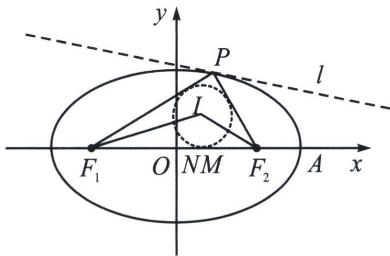

## 一、椭圆焦点三角形内心与离心率

内心定理: 如图, $I$ 为 $\triangle PF_{1}F_{2}$ 内切圆的圆心, $P I$ 和 $F_{1}F_{2}$ 相交于点 $N$ (区分切点 $M$ ),

则：① $\frac{|IN|}{|IP|}=e$ ，② $\frac{S_{\triangle IF_{1}F_{2}}}{S_{\triangle PF_{1}F_{2}}-S_{\triangle IF_{1}F_{2}}}=e.$

证明：①解法一：利用角平分线定理+比例性质： $\frac{|IN|}{|IP|}=\frac{|F_{1}N|}{|F_{1}P|}=\frac{|F_{2}N|}{|F_{2}P|}=\frac{|F_{1}N|+|F_{2}N|}{|F_{1}P|+|F_{2}P|}=\frac{2c}{2a}=e,$

解法二: (光学性质+中垂线)根据 $PN$ 为角平分线可知 $PN \perp l$ , (l 是椭圆在点 $P$ 处的切线), $PF_{2}$ 和 $PF_{1}$ 是入射光线和反射光线, 所以 $PN$ 是切点弦 $l$ 的中垂线(考虑极限情况, 切点看为两个交点的中点), 设 $P(x_{0}, y_{0})$ , 故根据中垂线截距定理 $x_{N} = \frac{c^{2} x_{0}}{a^{2}}$ , 再根据角平分线定理可知 $\frac{IN}{IP} = \frac{F_{1} P}{F_{1} N} = \frac{a + e x_{0}}{\frac{c^{2} x_{0}}{a^{2}} + c} = e$ ,

②根据等面积法， $\frac{|IN|}{|IP|}=\frac{|y_{I}|}{|y_{P}-y_{I}|}=\frac{c|y_{I}|}{c|y_{P}-y_{I}|}=\frac{S_{\triangle IF_{1}F_{2}}}{S_{\triangle PF_{1}F_{2}}-S_{\triangle IF_{1}F_{2}}}$

![[高中/总复习/专题/2026版高中《mst老唐说题》圆锥曲线专题（数学）/上册/第03章_几何视角下的焦点三角形/第三节_三角形四心性质的应用/一_椭圆焦点三角形内心与离心率/例题/Q00048490.md]]
