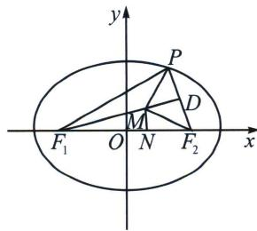

<!-- question-source:start -->
例1 (2022·雅安模拟)已知椭圆 $C: \frac{x^{2}}{a^{2}} + \frac{y^{2}}{b^{2}} = 1 (a > b > 0)$ 的左、右焦点分别为 $F_{1} 、 F_{1}$ , $P$ 为 $C$ 上异于左、右顶点的一点, $M$ 为 $\triangle PF_{1}F_{2}$ 内心, 若 $5 \overrightarrow{MF_{1}} + 3 \overrightarrow{MF_{2}} + 3 \overrightarrow{MP} = 0$ , 则该椭圆的离心率是 \_\_\_\_.

<!-- question-source:end -->

![[高中/总复习/专题/2026版高中《mst老唐说题》圆锥曲线专题（数学）/上册/第03章_几何视角下的焦点三角形/第三节_三角形四心性质的应用/一_椭圆焦点三角形内心与离心率/例题/answers/Q00048490A1.md]]
