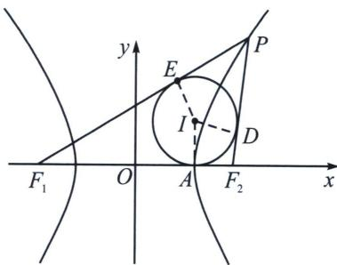

## 三、双曲线焦点三角形内心轨迹与双切圆

1. 内心轨迹方程

已知双曲线 $\frac{x^2}{a^2} -\frac{y^2}{b^2} = 1(a > 0,b > 0)$ ，则焦点三角形 $PF_{1}F_{2}$ 的内心 $I$ 的轨迹是： $x = \pm a$ ，和实轴的两个顶点相切.

证明：如图所示，以点 P 在右支上为例，设内切圆 I 和焦点三角形 $PF_{1}F_{2}$ 的三边分别切于点 A、D、E，则 $\left|OF_{1}\right| + \left|OA\right| = \left|F_{1}A\right| = \frac{\left|F_{1}P\right| + \left|F_{1}F_{2}\right| - \left|PF_{2}\right|}{2} = a + c$ ，故 $\left|OA\right| = a$ ，点 A 恰好和双曲线的顶点重合，则圆心 I 在直线 x = a 上.

注意 由于 $PI$ 位于点 $P(x_0, y_0)$ 处切线方程 $\frac{xx_0}{a^2} - \frac{yy_0}{b^2} = 1$ ，不妨令 $\left\{ \begin{array}{l} x_0 = \frac{a}{\cos \theta}, \\ y_0 = b \tan \theta \end{array} \right.$ ，即 $\frac{x}{a \cos \theta} - \frac{y \tan \theta}{b} = 1$ ，当 $x = a$ 时， $y = b \tan \frac{\theta}{2} \in (-b, b)$ ，所以内切圆半径 $r < b$ .

![[高中/总复习/专题/2026版高中《mst老唐说题》圆锥曲线专题（数学）/上册/第03章_几何视角下的焦点三角形/第三节_三角形四心性质的应用/三_双曲线焦点三角形内心轨迹与双切圆/例题/Q00048494.md]]
![[高中/总复习/专题/2026版高中《mst老唐说题》圆锥曲线专题（数学）/上册/第03章_几何视角下的焦点三角形/第三节_三角形四心性质的应用/三_双曲线焦点三角形内心轨迹与双切圆/例题/Q00048495.md]]
![[高中/总复习/专题/2026版高中《mst老唐说题》圆锥曲线专题（数学）/上册/第03章_几何视角下的焦点三角形/第三节_三角形四心性质的应用/三_双曲线焦点三角形内心轨迹与双切圆/例题/Q00048496.md]]
![[高中/总复习/专题/2026版高中《mst老唐说题》圆锥曲线专题（数学）/上册/第03章_几何视角下的焦点三角形/第三节_三角形四心性质的应用/三_双曲线焦点三角形内心轨迹与双切圆/例题/Q00048497.md]]
![[高中/总复习/专题/2026版高中《mst老唐说题》圆锥曲线专题（数学）/上册/第03章_几何视角下的焦点三角形/第三节_三角形四心性质的应用/三_双曲线焦点三角形内心轨迹与双切圆/例题/Q00048498.md]]
![[高中/总复习/专题/2026版高中《mst老唐说题》圆锥曲线专题（数学）/上册/第03章_几何视角下的焦点三角形/第三节_三角形四心性质的应用/三_双曲线焦点三角形内心轨迹与双切圆/例题/Q00048499.md]]
![[高中/总复习/专题/2026版高中《mst老唐说题》圆锥曲线专题（数学）/上册/第03章_几何视角下的焦点三角形/第三节_三角形四心性质的应用/三_双曲线焦点三角形内心轨迹与双切圆/例题/Q00048500.md]]
![[高中/总复习/专题/2026版高中《mst老唐说题》圆锥曲线专题（数学）/上册/第03章_几何视角下的焦点三角形/第三节_三角形四心性质的应用/三_双曲线焦点三角形内心轨迹与双切圆/例题/Q00048501.md]]
![[高中/总复习/专题/2026版高中《mst老唐说题》圆锥曲线专题（数学）/上册/第03章_几何视角下的焦点三角形/第三节_三角形四心性质的应用/三_双曲线焦点三角形内心轨迹与双切圆/例题/Q00052980.md]]
