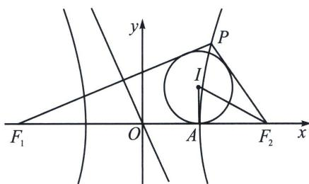

<!-- question-source:start -->
例4 (2024·和平区模拟)已知双曲线 $\frac{x^{2}}{a^{2}}-\frac{y^{2}}{b^{2}}=1(a>0,b>0)$ 的左右焦点记为 $F_{1}$ ， $F_{2}$ 且 $|F_{1}F_{2}|=4$ ，直线l过 $F_{2}$ 且与该双曲线的一条渐近线平行，记l与双曲线的交点为P，若所得 $\triangle PF_{1}F_{2}$ 的内切圆半径恰为$\frac{b}{3}$ , 则此双曲线的方程为 ( )
A. $x^{2}-\frac{y^{2}}{3}=1$ B. $\frac{x^{2}}{3}-y^{2}=1$ C. $\frac{x^{2}}{2}-\frac{y^{2}}{2}=1$ D. $\frac{3x^{2}}{2}-\frac{3y^{2}}{10}=1$

<!-- question-source:end -->

![[高中/总复习/专题/2026版高中《mst老唐说题》圆锥曲线专题（数学）/上册/第03章_几何视角下的焦点三角形/第三节_三角形四心性质的应用/三_双曲线焦点三角形内心轨迹与双切圆/例题/answers/Q00048494A1.md]]
