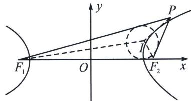

<!-- question-source:start -->
例5 (2024·松江区期中)已知点 $P$ 为双曲线 $\frac{x^2}{16} - \frac{y^2}{9} = 1$ 右支上的一点, $F_1$ , $F_2$ 分别为双曲线的左、右焦点, 点 $I$ 为 $\triangle PF_1F_2$ 的内心, 若 $S_{\triangle IPF_1} = S_{\triangle IPF_2} + \lambda \cdot S_{\triangle IF_1F_2}$ 成立, 则 $\lambda$ 的值为 \_\_\_\_.

<!-- question-source:end -->

![[高中/总复习/专题/2026版高中《mst老唐说题》圆锥曲线专题（数学）/上册/第03章_几何视角下的焦点三角形/第三节_三角形四心性质的应用/三_双曲线焦点三角形内心轨迹与双切圆/例题/answers/Q00048495A1.md]]
