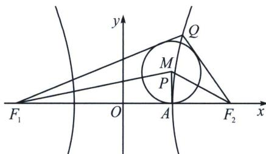

<!-- question-source:start -->
例6 (2024·宝山区期中)已知双曲线 $G: \frac{x^2}{16} - \frac{y^2}{9} = 1$ ，其左、右焦点分别是 $F_1, F_2$ ，点 $P$ 坐标为(4，

2)，双曲线 G 上的 $Q(x_{0}, y_{0})(x_{0}, y_{0}>0)$ 满足 $\frac{\overrightarrow{QF_{1}}\cdot\overrightarrow{PF_{1}}}{|\overrightarrow{QF_{1}}|}=\frac{\overrightarrow{F_{2}F_{1}}\cdot\overrightarrow{PF_{1}}}{|\overrightarrow{F_{2}F_{1}}|}$ ，则 $(S_{\triangle F_{1}PQ}-S_{\triangle F_{2}PQ})(|QF_{2}|-|QF_{1}|)=$ \_\_\_\_.

<!-- question-source:end -->

![[高中/总复习/专题/2026版高中《mst老唐说题》圆锥曲线专题（数学）/上册/第03章_几何视角下的焦点三角形/第三节_三角形四心性质的应用/三_双曲线焦点三角形内心轨迹与双切圆/例题/answers/Q00048496A1.md]]
