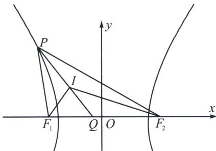

<!-- question-source:start -->
例7 (2024·成都青羊区模拟)已知双曲线 $\frac{x^{2}}{a^{2}}-\frac{y^{2}}{b^{2}}=1(a>0,b>0)$ 的左、右焦点分别为 $F_{1}$ ， $F_{2}$ ，P为左支上一点， $\angle PF_{1}F_{2}=\frac{2\pi}{3}$ ， $\triangle PF_{1}F_{2}$ 的内切圆圆心为I，直线PI与x轴交于点Q，若双曲线的离心率为 $\frac{5}{4}$ ，则 $\frac{|PI|}{|IQ|}=$ \_\_\_\_.

<!-- question-source:end -->

![[高中/总复习/专题/2026版高中《mst老唐说题》圆锥曲线专题（数学）/上册/第03章_几何视角下的焦点三角形/第三节_三角形四心性质的应用/三_双曲线焦点三角形内心轨迹与双切圆/例题/answers/Q00048497A1.md]]
