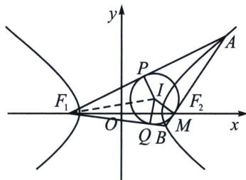

<!-- question-source:start -->
例9 (2024·多选·临沂三模)已知双曲线 $C: \frac{x^2}{a^2} - y^2 = 1 (a > 0)$ 的渐近线方程为 $y = \pm \frac{1}{2} x$ , 过 $C$ 的右焦点 $F_2$ 的直线交双曲线右支于 $A, B$ 两点, $\triangle F_1AB$ 的内切圆分别切直线 $F_1A, F_1B, AB$ 于点 $P, Q, M$ , 内切圆的圆心为 $I$ , 半径为 $\sqrt{2}$ , 则 ( )
A. $C$ 的离心率等于 $\frac{\sqrt{5}}{2}$ B. 切点 $M$ 与右焦点 $F_2$ 重合
C. $S_{\triangle F_1BI} + S_{\triangle F_1AI} - S_{\triangle ABI} = 2\sqrt{2}$ D. $\cos \angle AF_1B = \frac{7}{9}$

<!-- question-source:end -->

![[高中/总复习/专题/2026版高中《mst老唐说题》圆锥曲线专题（数学）/上册/第03章_几何视角下的焦点三角形/第三节_三角形四心性质的应用/三_双曲线焦点三角形内心轨迹与双切圆/例题/answers/Q00048499A1.md]]
