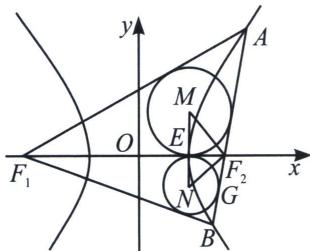
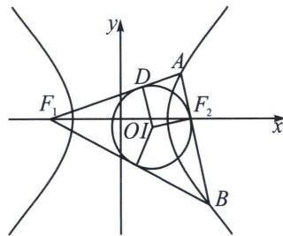

<!-- question-source:start -->
例10 (2024·多选·潍坊月考)已知双曲线 $C: x^{2} - \frac{y^{2}}{3} = 1$ 的左、右焦点分别为 $F_{1}, F_{2}$ , 右顶点为 $E$ , 过 $F_{2}$ 的直线交双曲线 $C$ 的右支于 $A, B$ 两点 (其中点 $A$ 在第一象限内), 设 $M, N$ 分别为 $\triangle AF_{1}F_{2}$ , $\triangle BF_{1}F_{2}$ 的内心, 则 ( )
A. 点 $M$ 的横坐标为 2 B. 当 $F_{1}A \perp AB$ 时, $|AF_{1}| = 1 + \sqrt{7}$ C. 当 $F_{1}A \perp AB$ 时, $\triangle ABF_{1}$ 内切圆的半径为 $-1 + \sqrt{7}$ D. $|ME||NE| = 1$

<!-- question-source:end -->

![[高中/总复习/专题/2026版高中《mst老唐说题》圆锥曲线专题（数学）/上册/第03章_几何视角下的焦点三角形/第三节_三角形四心性质的应用/三_双曲线焦点三角形内心轨迹与双切圆/例题/answers/Q00048500A1.md]]
