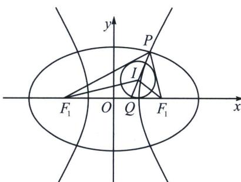

> [!faq]- 《圆锥曲线专题(上册)》例题解析
>
> > [!success]- **【答案】** -64
>
> > [!note]- **【解析】**
> > 解析 如图，双曲线 $G: \frac{x^2}{16} - \frac{y^2}{9} = 1$ 的实半轴长 $a = 4$ ，连接 $QF_1, QF_2$ ，设 $\triangle F_1QF_2$ 的内切圆为 $M$ ，易知圆心 $M$ 的横坐标为 4 ，由 $\frac{\overrightarrow{QF_1} \cdot \overrightarrow{PF_1}}{|\overrightarrow{QF_1}|} = \frac{\overrightarrow{F_2F_1} \cdot \overrightarrow{PF_1}}{|\overrightarrow{F_2F_1}|}$ ，得 $|\overrightarrow{PF_1}| \cos \angle PF_1Q = |\overrightarrow{PF_1}| \cos \angle PF_1F_2$ ，则 $\angle PF_1Q = \angle PF_1F_2$ ，即 $P$ 在 $\angle QF_1F_2$ 的角平分线上，则 $P$ 与 $M$ 重合，可得圆 $M$ 的半径 $r = 2$ .
> >
> > $(S_{\triangle F_{1}PQ}-S_{\triangle F_{2}PQ})(|QF_{2}|-|QF_{1}|)=\left(\frac{1}{2}|QF_{1}|\cdot r-\frac{1}{2}|QF_{2}|\cdot r\right)(|QF_{2}|-|QF_{1}|)=\frac{1}{2}\times2\times8\times(-8)=-64.$ 故答案为 -64.
> >
> > ## 2. 离心率问题
> >
> > 类比椭圆，已知双曲线 $\frac{x^2}{a^2} -\frac{y^2}{b^2} = 1(a > 0,b > 0)$ ， $I$ 为焦点三角形 $PF_{1}F_{2}$ 的内切圆， $PI$ 交 $x$ 轴于 $Q$ ，设 $\angle F_1PF_2 = \alpha$ ，找出与双曲线共焦点的椭圆，则椭圆离心率 $e_1 = \frac{|F_1F_2|}{|PF_1| + |PF_2|} = \frac{|IQ|}{|IP|}$ ，通过求出 $|PF_1|$ 和 $|PF_2|$ 长度得出 $e_2 = \frac{|F_1F_2|}{|PF_1| - |PF_2|}$ ，或者利用 $\frac{\sin^2\frac{\alpha}{2}}{e_1^2} +\frac{\cos^2\frac{\alpha}{2}}{e_2^2} = 1$ 得出 $e_2$
> >
> > 
> >
> > 证明：如图所示，点 P 在两共焦点椭圆与双曲线的第一象限交点为例，以椭圆为轴心，根据内角平分线定理， $\frac{|PF_{1}|}{|F_{1}Q|}=\frac{|PF_{2}|}{|F_{2}Q|}=\frac{|PF_{1}|+|PF_{2}|}{|F_{1}Q|+|F_{2}Q|}=\frac{|PI|}{|IQ|}=\frac{2a_{1}}{2c}=\frac{1}{e_{1}}$ ，故可以利用 $\frac{\sin^{2}\frac{\alpha}{2}}{e_{1}^{2}}+\frac{\cos^{2}\frac{\alpha}{2}}{e_{2}^{2}}=1$ 得出 $e_{2}$ .
> >
> > 如果给出 $\angle PF_{1}F_{2}$ 或者 $\angle PF_{2}F_{1}$ 角度，也可以直接利用焦长公式算出双曲线的 $|PF_1| + |PF_2|$ 这个整体.
