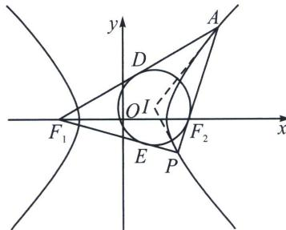

> [!faq]- 《圆锥曲线专题(上册)》例题解析
>
> > [!success]- **【答案】** 详见解析
>
> > [!note]- **【分析】**
> > 本题未单列分析。
>
> > [!note]- **【解析】**
> > 解析 设 $\frac{|PI|}{|IQ|} = \lambda$ ，由 $I$ 为 $\triangle PF_1F_2$ 的内切圆的圆心，可得 $\frac{|PI|}{|IQ|} = \frac{|PF_1|}{|F_1Q|} = \frac{|PF_2|}{|F_2Q|} = \frac{|PF_1| + |PF_2|}{|F_1Q| + |F_2Q|}$ $= \lambda$ ，即有 $|PF_1| = \frac{b^2}{a + c\cos\frac{2\pi}{3}} = \frac{b^2}{a - \frac{c}{2}}$ ，由于 $e = \frac{5}{4}$ ，故 $c = \frac{5}{4} a$ ， $|PF_1| = \frac{c^2 - a^2}{a - \frac{c}{2}} = \frac{\frac{9a^2}{16}}{\frac{3a}{8}} = \frac{3}{2} a$ ， $|PF_2| = \frac{7}{2} a$ ，故 $\lambda = \frac{|PF_1| + |PF_2|}{|F_1Q| + |F_2Q|} = \frac{5a}{2c} = \frac{5}{2e} = 2$ 。故答案为 2。
> > ## 3. 大焦点三角形内切圆切于焦点
> > 
> > 如图，大焦点三角形 $APF_{1}$ ，① $AP$ 与内切圆切于 $F_{2}$ ，② $\left|F_{1}D\right| = \left|F_{1}E\right| = 2a$
> > 证明： $\left|AF_{1}\right|-\left|AF_{2}\right|=\left|PF_{1}\right|-\left|PF_{2}\right|=2a$ ，设内切圆与 $AF_{1}$ 、 $PF_{1}$ 、AP分别切于D、E、G三点，则 $\left|AF_{1}\right|+\left|PF_{1}\right|-\left|AP\right|=4a=2\left|DF_{1}\right|=2\left|EF_{1}\right|$ ，故 $\left|AF_{1}\right|-\left|AG\right|=\left|PF_{1}\right|-\left|PG\right|=\left|DF_{1}\right|=\left|EF_{1}\right|=2a$ ，故G与 $F_{2}$ 重合.
