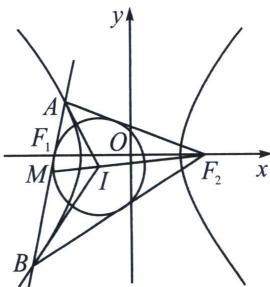
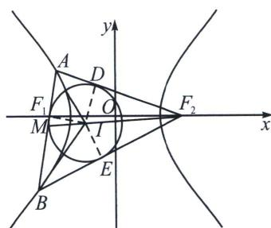

> [!faq]- 《圆锥曲线专题(上册)》例题解析
>
> > [!success]- **【答案】** A
>
> > [!note]- **【分析】**
> > 本题未单列分析。
>
> > [!note]- **【解析】**
> > 解析 解法一：设内切圆的半径为 r，由 $S_{\triangle IAF_{2}}: S_{\triangle IBF_{2}} = 3: 5$ ，即 $\frac{\frac{1}{2} \cdot |AF_{2}| \cdot r}{\frac{1}{2} \cdot |BF_{2}| \cdot r} = \frac{3}{5}$ ，则 $\frac{|AF_{2}|}{|BF_{2}|} = \frac{3}{5}$ ，
> > 
> > 
> > 设 $|AF_{2}|=3t$ ，则 $|BF_{2}|=5t$ ，则 $|AF_{1}|=3t-2a$ ， $|BF_{1}|=5t-2a$ ，由 $|F_{2}I|:\left|IM\right|=2:1$ ，即 $|F_{2}M|:\left|IM\right|=3:1$ ，则 $S_{\triangle MBI}=\frac{1}{3}S_{\triangle MBF_{2}}$ ， $S_{\triangle MBI}=\frac{1}{2}S_{\triangle BIF_{2}}$ ， $\frac{\frac{1}{2}\cdot\left|MB\right|\cdot r}{\frac{1}{2}\cdot\left|BF_{2}\right|\cdot r}=\frac{1}{2}$ ，则 $\frac{\left|MB\right|}{\left|BF_{2}\right|}=\frac{1}{2}$ ，故 $|MB|=\frac{5t}{2}$ ，同理得 $|MA|=\frac{3t}{2}$ ，故 $|AB|=|AM|+|BM|=4t=8t-4a$ ，故t=a，则 $|AB|^{2}+|AF_{2}|^{2}=$ $|BF_{2}|^{2}$ ，故 $AB\perp AF_{2}$ ，则 $2c=\sqrt{|AF_{1}|^{2}+|AF_{2}|^{2}}=\sqrt{a^{2}+(3a)^{2}}=\sqrt{10}a$ ，则 $e=\frac{c}{a}=\frac{\sqrt{10}}{2}$ .
> > 解法二：如右图，易知 $F_{1}$ 为切点，找到圆与 $AF_{2}$ ， $BF_{2}$ 切点 D 和 E，连接 ID、IE、 $IF_{1}$ ，易知 $\left|DF_{2}\right|=\left|EF_{2}\right|=2a,\quad\frac{\left|F_{2}I\right|}{\left|IM\right|}=\frac{\left|AF_{2}\right|}{\left|AM\right|}=\frac{\left|BF_{2}\right|}{\left|BM\right|}=\frac{\left|AF_{2}\right|+\left|BF_{2}\right|}{\left|AB\right|}=\frac{\left|AB\right|+4a}{\left|AB\right|}=\frac{2}{1}$ ，所以 $\left|AB\right|=4a,\quad\frac{\left|AF_{2}\right|}{\left|BF_{2}\right|}=\frac{3}{5}$ ，则 $\left|AF_{2}\right|=3a,\quad\left|BF_{2}\right|=5a$ ，则 $\left|AB\right|^{2}+\left|AF_{2}\right|^{2}=\left|BF_{2}\right|^{2}$ ，故 $AB\perp AF_{2}$ ，则 $2c=\sqrt{\left|AF_{1}\right|^{2}+\left|AF_{2}\right|^{2}}=\sqrt{a^{2}+(3a)^{2}}=\sqrt{10}a$ ，则 $e=\frac{c}{a}=\frac{\sqrt{10}}{2}$ 。
> >
> > 故选 **A**.
