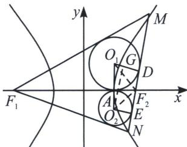

> [!faq]- 《圆锥曲线专题(上册)》例题解析
>
> > [!success]- **【答案】** ABD
>
> > [!note]- **【分析】**
> > 本题未单列分析。
>
> > [!note]- **【解析】**
> > 解析 A 选项，由题意得 $\frac{1}{a} = \frac{1}{2}$ ，解得 $a = 2$ ，故离心率 $e = \frac{c}{a} = \frac{\sqrt{4 + 1}}{2} = \frac{\sqrt{5}}{2}$ ，A 正确；
> > B选项， $|AP| = |AM|$ ， $|F_{1}P| = |F_{1}Q|$ ， $|QB| = |BM|$ ，由双曲线定义可得 $|AF_1| - |AF_2| = 2a = 4$ ， $|BF_1| - |BF_2| = 2a = 4$ ，两式相减得 $|AF_1| - |BF_1| = |AF_2| - |BF_2|$ ，即 $|AP| - |BQ| = |AM| - |BM| = |AF_2| - |BF_2|$ ，故切点 $M$ 与右焦点 $F_{2}$ 重合，B正确；
> > C选项， $\triangle F_{1}AB$ 的内切圆的半径为 $r = \sqrt{2}$ ，故 $S_{\triangle F_1BI} + S_{\triangle F_1AI} - S_{\triangle ABI} = \frac{1}{2} |F_1A|r + \frac{1}{2} |F_1B|r - \frac{1}{2}|AB|r = \frac{1}{2} (|F_1A| + |F_1B| - |AB|)\times \sqrt{2} = \frac{1}{2} (|F_1A| - |AM| + |F_1B| - |BM|)\times \sqrt{2} = \frac{1}{2}\times 4a\times \sqrt{2} = 4\sqrt{2}$ ，C错误；
> > D选项，连接 $F_{1}I$ ，则 $F_{1}I$ 平分 $\angle AF_1B$ ，其中 $|F_1P| = |AF_1| - |AP| = |AF_1| - |AF_2| = 2a = 4,$
> > 故 $\tan \angle AF_{1}I = \tan \alpha = \frac{|PI|}{|PF_{1}|} = \frac{\sqrt{2}}{4}$ ，所以 $\cos \angle AF_{1}B = \cos^{2}\alpha - \sin^{2}\alpha = \frac{\cos^{2}\alpha - \sin^{2}\alpha}{\cos^{2}\alpha + \sin^{2}\alpha} = \frac{1 - \tan^{2}\alpha}{1 + \tan^{2}\alpha} = \frac{1 - \left(\frac{\sqrt{2}}{4}\right)^{2}}{1 + \left(\frac{\sqrt{2}}{4}\right)^{2}} = \frac{7}{9}$ ，D正确。故选ABD.
> > ## 4. 双切圆问题
> > 如图所示， $O_{1}$ 为焦点三角形 $MF_{1}F_{2}$ 的内心， $O_{2}$ 为焦点三角形 $NF_{1}F_{2}$ 的内心，MN 倾斜角为 $\alpha$ ，令 $|AO_{1}| = r_{1}$ ， $|AO_{2}| = r_{2}$ ，则一定有 $|O_{1}O_{2}| = r_{1} + r_{2} = \frac{2(c - a)}{\sin\alpha}$ ①； $r_{1}r_{2} = (c - a)^{2}$ ②； $\frac{r_{1}}{r_{2}} = \frac{1}{\tan^{2}\frac{\alpha}{2}}$ ③
> > 证明：由于 $O_{1}O_{2} // y$ 轴，作 $O_{1}D \perp MN$ 于 $D$ ， $O_{2}E \perp MN$ 于 $E$ ， $O_{2}G // MN$ 交 $O_{1}D$ 于 $G$ ，易知 $|O_{1}O_{2}| = r_{1} + r_{2}$ ， $|O_{2}G| = |DE| = 2|AF_{2}| = 2(c - a)$ ， $\angle O_{2}O_{1}D = \alpha$ ，所以 $|O_{1}O_{2}| = \frac{2(c - a)}{\sin \alpha}$ 。根据内心定理， $O_{1}F_{2}$ 、 $O_{2}F_{2}$ 分别为 $\angle MF_{2}F_{1}$ 和 $\angle NF_{2}F_{1}$ 的平分线，所以 $O_{1}F_{2} \perp O_{2}F_{2}$ ，根据射影定理， $|AO_{1}| |AO_{2}| = |AF_{2}|^{2}$ ， $r_{1}r_{2} = (c - a)^{2}$ ， $\frac{r_{1}}{r_{2}} = \frac{\frac{|AF_{2}|}{\tan \angle AO_{1}F_{2}}}{|AF_{2}| \tan \angle AF_{2}O_{2}} = \frac{1}{\tan^{2}\frac{\alpha}{2}}$ 。
> > 
