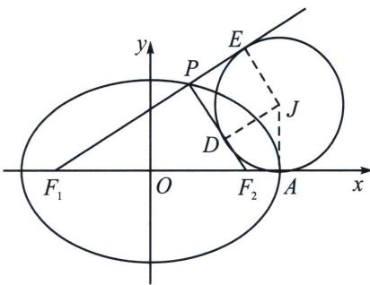

## 二、椭圆焦点三角形旁心轨迹

如图所示，焦点三角形 $PF_{1}F_{2}$ 的旁切圆 J 和 $F_{1}F_{2}$ 的延长线、 $PF_{2}$ 、 $F_{1}P$ 的延长线分别切于点 A（长轴顶点）、D、E，旁心 J 的轨迹为： $x=\pm a$ .

证明： $|F_{1}A| = |F_{1}F_{2}| + |F_{2}A| = |F_{1}F_{2}| + |F_{2}D|$ ， $|F_{1}E| = |F_{1}P| + |PE| = |F_{1}P| + |PD|$ ，又 $|F_{1}A| = |F_{1}E|$ ，故 $2|F_{1}A| = |F_{1}F_{2}| + |F_{2}D| + |F_{1}P| + |PD| = |F_{1}F_{2}| + |F_{1}P| + |F_{2}P| = 2(a + c)$ ， $|F_{1}A| = a + c$ ，又 $|F_{1}A| = |F_{1}O| + |OA|$ ，故 $|OA| = a$ ，点 $A$ 恰好和椭圆的长轴端点重合.

注意 根据光学性质，我们易知 $PJ$ 即为点 $P$ 处切线，方程为 $\frac{xx_0}{a^2} +\frac{yy_0}{b^2} = 1$ ，令 $\left\{ \begin{array}{l}x_{0} = a\cos \theta \\ y_{0} = b\sin \theta \end{array} \right.$ ，即 $\frac{x\cos\theta}{a} +\frac{y\sin\theta}{b} = 1$ ，当 $x = a$ 时， $y = b\tan \frac{\theta}{2}\in (-b,b)$ ，所以旁切圆半径 $r < b$

![[高中/总复习/专题/2026版高中《mst老唐说题》圆锥曲线专题（数学）/上册/第03章_几何视角下的焦点三角形/第三节_三角形四心性质的应用/二_椭圆焦点三角形旁心轨迹/例题/Q00048491.md]]
![[高中/总复习/专题/2026版高中《mst老唐说题》圆锥曲线专题（数学）/上册/第03章_几何视角下的焦点三角形/第三节_三角形四心性质的应用/二_椭圆焦点三角形旁心轨迹/例题/Q00048492.md]]
