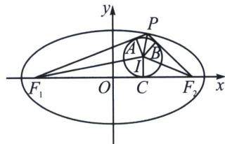
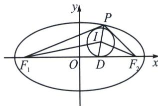

> [!faq]- 《圆锥曲线专题(上册)》例题解析
>
> > [!success]- **【答案】** ACD
>
> > [!note]- **【解析】**
> > 解析 若 C 是内切圆与 x 轴的切点， $\left|PF_{1}\right|+\left|PF_{2}\right|=2a,\quad\left|PA\right|=\left|PB\right|=\frac{1}{2}a,\quad\left|AF_{1}\right|=\left|CF_{1}\right|$ ， $\left|BF_{2}\right|=\left|CF_{2}\right|$ ，又 $\left|PA\right|+\left|AF_{1}\right|+\left|PB\right|+\left|BF_{2}\right|=2a$ ，则 $\left|AF_{1}\right|+\left|BF_{2}\right|=a$ ，即 $\left|CF_{1}\right|+\left|CF_{2}\right|=2c=a$ ，所以离心率 $e=\frac{c}{a}=\frac{1}{2}$ ，A 对；
> >
> > 
> >
> > 解法一：若 $D(x_{1},0)$ 为 PI 延长线与 x 轴的交点， $P(x_{2},y_{2})$ ， $I(x,y)$ 且 x， $y\neq0$ ，则 $\frac{x_{2}^{2}}{a^{2}}+\frac{y_{2}^{2}}{b^{2}}=1$ ，故 $b^{2}=\frac{a^{2}y_{2}^{2}}{a^{2}-x_{2}^{2}}$ ，由角平分线的性质可得 $\frac{|DF_{1}|}{|PF_{1}|}=\frac{|DI|}{|PI|}=\frac{|DF_{2}|}{|PF_{2}|}$ ，则 $\frac{|DI|}{|PI|}=\frac{|DF_{1}|+|DF_{2}|}{|PF_{1}|+|PF_{2}|}=\frac{c}{a}=e$ ，所以 $\frac{y}{y_{2}}=\frac{x-x_{1}}{x_{2}-x_{1}}=\frac{|DI|}{|PI|+|DI|}=\frac{c}{a+c}$ ，则 $y_{2}=\frac{(a+c)y}{c}$ ，又 $\frac{|DF_{2}|}{|DF_{1}|}=\frac{c-x_{1}}{x_{1}+c}=\frac{|PF_{2}|}{|PF_{1}|}=\frac{a-ex_{2}}{a+ex_{2}}$ ，则 $x_{1}=e^{2}x_{2}$ ，故 $\frac{x-e^{2}x_{2}}{x_{2}-e^{2}x_{2}}=\frac{c}{a+c}=\frac{e}{1+e}$ ，所以 $x_{2}=\frac{x}{e}$ ，故 $\frac{x^{2}}{e^{2}a^{2}}+\frac{(a+c)^{2}y^{2}}{b^{2}c^{2}}=1$ ，则 $\frac{x^{2}}{c^{2}}+\frac{y^{2}}{\frac{b^{2}c^{2}}{(a+c)^{2}}}=1$ 且 x， $y\neq0$ ，
> >
> > 所以动点 I 的轨迹是一个不含 x，y 轴交点的椭圆曲线，不是完整椭圆轨迹，B 错；
> >
> > 
> >
> > 由上分析， $k_{IF_{1}}=\frac{y}{x+c}$ ， $k_{IF_{2}}=\frac{y}{x-c}$ ，则 $k_{IF_{1}}k_{IF_{2}}=\frac{y^{2}}{x^{2}-c^{2}}=\frac{\frac{b^{2}c^{2}}{(a+c)^{2}}\left(1-\frac{x^{2}}{c^{2}}\right)}{x^{2}-c^{2}}=-\frac{b^{2}}{(a+c)^{2}}$ 为定值，C对；
> >
> > 解法二： $\frac{|ID|}{|IP|}=\frac{|F_{1}D|}{|F_{1}P|}=\frac{|F_{2}D|}{|F_{2}P|}=\frac{|F_{1}D|+|F_{2}D|}{|F_{1}P|+|F_{2}P|}=e,\quad\angle PF_{1}F_{2}=\alpha,\quad\angle PF_{2}F_{1}=\beta,$
> >
> > $$
> > e = \frac {2 c}{2 a} = \frac {\left| F _ {1} F _ {2} \right|}{\left| P F _ {1} \right| + \left| P F _ {2} \right|} = \frac {\sin (\alpha + \beta)}{\sin \alpha + \sin \beta} = \frac {\cos \frac {\alpha + \beta}{2}}{\cos \frac {\alpha - \beta}{2}} = \frac {\cos \frac {\alpha}{2} \cos \frac {\beta}{2} - \sin \frac {\alpha}{2} \sin \frac {\beta}{2}}{\cos \frac {\alpha}{2} \cos \frac {\beta}{2} + \sin \frac {\alpha}{2} \sin \frac {\beta}{2}} = \frac {1 - \tan \frac {\alpha}{2} \tan \frac {\beta}{2}}{1 + \tan \frac {\alpha}{2} \tan \frac {\beta}{2}},
> > $$
> >
> > 所以 $\tan \frac{\alpha}{2} \cdot \tan \frac{\beta}{2} = \frac{1 - e}{1 + e}$ ，所以 $k_{IF_1} k_{IF_2} = -\frac{1 - e}{1 + e} = -\frac{b^2}{(a + c)^2}$ ，根据第三定义，轨迹为不包含 $F_1$ 和 $F_2$ 的椭圆，B 错误，C 正确；
> >
> > 由图，由于 P 不在坐标轴上，而内切圆 I 的半径在 P 靠近 x 轴时趋向于 0，靠近 y 轴时趋向于 $\frac{a+c}{bc}$ ，
> >
> > 即内切圆 $I$ 的半径 $r \in \left(0, \frac{a + c}{bc}\right)$ ，故其面积不存在最值，D对．
> >
> > 故选 **ACD**.
