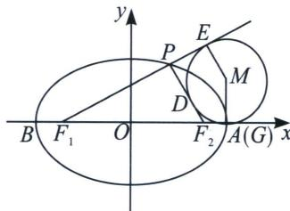

> [!faq]- 《圆锥曲线专题(上册)》例题解析
>
> > [!success]- **【答案】** D
>
> > [!note]- **【分析】**
> > 本题未单列分析。
>
> > [!note]- **【解析】**
> > 解析 如图，设切点分别为 E, D, G. 由切线长相等，得 $\left|F_{1}E\right|=\left|F_{1}G\right|$ ， $\left|F_{2}D\right|=\left|F_{2}G\right|$ ， $\left|PD\right|=\left|PE\right|$ .
> > 
> > 由椭圆的定义，得 $|F_{1}P| + |PF_{2}| = |F_{1}P| + |PD| + |DF_{2}| = |F_{1}E| + |DF_{2}| = 2a$ ，即 $|F_{1}E| + |GF_{2}| = 2a$ ，也即 $|F_{1}G| + |GF_{2}| = 2a$ ，故点 $G$ 与点 $A$ 重合，所以点 $M$ 的横坐标是 $x = a$ ，即点 $M$ 的轨迹是一条直线(除去点 $A$ )．
> >
> > 故选 **D**.
