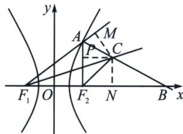

<!-- question-source:start -->
例13（河北省2025届高考冲刺模拟考试T8）已知双曲线 $E: \frac{x^{2}}{a^{2}} - \frac{y^{2}}{b^{2}} = 1 (a > 0, b > 0)$ 的左、右焦点分别为 $F_{1}, F_{2}$ ，点 $A$ 为 $E$ 右支上一点，射线 $AB$ 是 $\angle F_{1}AF_{2}$ 的外角平分线，其与 $x$ 轴的交点为点 $B$ ， $\angle AF_{1}F_{2}$ 的角平分线与直线 $AB$ 交于点 $C$ ，若 $3\overrightarrow{AC} = \overrightarrow{AB}$ ，则双曲线 $E$ 的离心率为 ( )
A. $\sqrt{2}$ B. $\sqrt{3}$ C. 2
D. $\sqrt{5}$

<!-- question-source:end -->

![[高中/总复习/专题/2026版高中《mst老唐说题》圆锥曲线专题（数学）/上册/第03章_几何视角下的焦点三角形/第三节_三角形四心性质的应用/四_双曲线焦点三角形旁心与离心率/例题/answers/Q00048503A1.md]]
