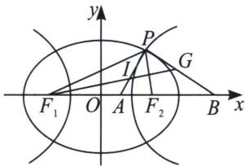

<!-- question-source:start -->
例14（2023哈三中高三一模16题）如图，椭圆 $\frac{x^{2}}{a^{2}}+\frac{y^{2}}{b^{2}}=1(a>b>0)$ 与双曲线 $\frac{x^{2}}{m^{2}}-\frac{y^{2}}{n^{2}}=1(m>0,n>0)$ 有公共焦点 $F_{1}(-c,0)$ ， $F_{2}(c,0)$ ，椭圆的离心率为 $e_{1}$ ，双曲线的离心率为 $e_{2}$ ，点P为两曲线的一个公共

123 老唐说题

点， $\angle F_{1}PF_{2}=60^{\circ}$ ，则 $\frac{1}{e_{1}^{2}}+\frac{3}{e_{2}^{2}}=$ \_\_\_\_； $I$ 为 $\triangle PF_{1}F_{2}$ 的内心， $F_{1}$ 、 $I$ 、 $G$ 三点共线，且 $\overrightarrow{GP}\cdot\overrightarrow{IP}=0$ ， $x$ 轴上点 $A$ 、 $B$ 满足 $\overrightarrow{AI}=\lambda\overrightarrow{IP}$ ， $\overrightarrow{BG}=\mu\overrightarrow{GP}$ ，则 $\lambda^{2}+\mu^{2}$ 的最小值为\_\_\_\_。

<!-- question-source:end -->

![[高中/总复习/专题/2026版高中《mst老唐说题》圆锥曲线专题（数学）/上册/第03章_几何视角下的焦点三角形/第三节_三角形四心性质的应用/四_双曲线焦点三角形旁心与离心率/例题/answers/Q00048504A1.md]]
