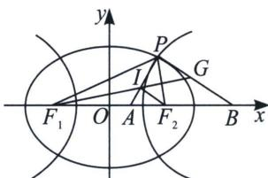
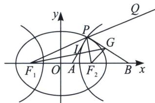

> [!faq]- 《圆锥曲线专题(上册)》例题解析
>
> > [!success]- **【答案】** 详见解析
>
> > [!note]- **【解析】**
> > 解析 这个题第一空很简单，也是一个结论题，我们很容易通过 $\frac{\sin^{2}\frac{\alpha}{2}}{e_{1}^{2}}+\frac{\cos^{2}\frac{\alpha}{2}}{e_{2}^{2}}=1$ 得出 $\frac{1}{e_{1}^{2}}+\frac{3}{e_{2}^{2}}=4$ ；我们来分析第二问，第二问我们给出两种思考方法，第一种方法专题专对，第二种方法是普适性.
> >
> > 解法一：推导构造加强二级结论，我们证明 $\lambda = \frac{AI}{IP} = e_1$ ， $\mu = \frac{BG}{GP} = e_2$ ，然后结合第一空，用柯西不等式解决.
> >
> > 先证 $\lambda = \frac{AI}{IP} = e_1$ ，如下左图，连接 $IF_{2}$ ，则 $\lambda = \frac{AI}{IP} = \frac{F_1P}{F_1A} = \frac{F_2P}{F_2A} = \frac{F_1P + F_2P}{F_1A + F_2A} = \frac{2c}{2a} = e_1$
> >
> > 
> >
> > 
> >
> > 再证 $\mu = \frac{BG}{GP} = e_2$ ，如右上图，延长 $F_{1}P$ 至 $Q$ ，连接 $GF_{2}$ ，由于 $\overrightarrow{GP} \cdot \overrightarrow{IP} = 0$ ，且 $\angle F_{1}PA = \angle APF_{2}$ ，故 $\angle F_{2}PB = \angle BPQ$ ，故 $G$ 是 $\triangle F_{1}PF_{2}$ 旁心，同时也满足 $\mu = \frac{BG}{GP} = \frac{BF_{2}}{PF_{2}} = \frac{BF_{1}}{PF_{1}} = \frac{BF_{1} - BF_{2}}{PF_{1} - PF_{2}} = \frac{2c}{2m} = e_{2}$ ，
> >
> > 所以 $\lambda^2 +\mu^2 = \frac{1}{4} (e_1^2 +e_2^2)\left(\frac{1}{e_1^2} +\frac{3}{e_2^2}\right)\geqslant \frac{1}{4} (1 + \sqrt{3})^2 = 1 + \frac{\sqrt{3}}{2}$ ，当且仅当 $\sqrt{3} e_1^2 = e_2^2$ 时等号成立；
> >
> > 解法二：光学性质+中垂线，根据 $PA \perp PB$ 即可知道 $PB$ 是椭圆的切线， $PF_{2}$ 和 $PF_{1}$ 是入射光线和反射光线，所以 $PA$ 是切点弦 $PB$ 的中垂线（考虑极限情况，切点看为两个交点的中点），设 $P(x_{0}, y_{0})$ ，故根据中垂线截距定理 $x_{A} = \frac{c^{2}x_{0}}{a^{2}}$ ，同理， $PA$ 是双曲线的切点弦（切线是切点弦极限情况）， $PB$ 是切点弦 $PA$ 的中垂线，根据中垂线截距定理 $x_{B} = \frac{c^{2}x_{0}}{m^{2}}$ ，再根据角平分线定理可知 $\lambda = \frac{AI}{IP} = \frac{F_{1}P}{F_{1}A} = \frac{a + e_{1}x_{0}}{\frac{c^{2}x_{0}}{a^{2}} + c} = e_{1}$ ， $\mu = \frac{BG}{GP} = \frac{BF_{1}}{PF_{1}} = \frac{\frac{c^{2}x_{0}}{m^{2}} + c}{e_{2}x_{0} + a} = e_{2}$ ，余下同解法一， $\lambda^{2} + \mu^{2} \geqslant 1 + \frac{\sqrt{3}}{2}$ .
> >
> > 注意 纵横交错的知识点，离心率全部靠椭圆内心 $e_1 = \frac{\text{短}}{\text{长}}$ ，双曲线旁心 $e_2 = \frac{\text{长}}{\text{短}}$ ，关键时候焦半径结合中垂线光学性质能帮忙，本题是一个好题，这个题弄通透了，基本上焦点三角形的离心率问题都能形成闭环。
