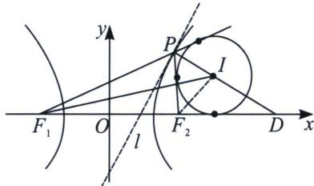

## 四、双曲线焦点三角形旁心与离心率

$I$ 是 $\triangle PF_{1}F_{2}$ 的旁心， $F_{1}I$ 、 $F_{2}I$ 分别是 $\angle PF_{1}D$ 、 $\angle PF_{2}D$ 的角平分线．如图，则： $\frac{|ID|}{|IP|} = e, \frac{S_{\triangle IF_1D}}{S_{\triangle PF_1I}} = e.$ 证明：解法一（外角平分线定理+比例性质）： $\frac{S_{\triangle DIF_1}}{S_{\triangle PIF_1}} = \frac{|ID|}{|PI|} = \frac{|DF_1|}{|PF_1|} = \frac{|F_2D|}{|PF_2|} = \frac{|DF_1| - |F_2D|}{|PF_1| - |PF_2|} = \frac{2c}{2a} = e,$

解法二: (中垂线截距+光学性质) $l$ 是双曲线的切点弦(切线是切点弦极限情况), $P D$ 是切点弦 $l$ 的中垂线, 根据中垂线截距定理 $x _ { D } = \frac { c ^ { 2 } x _ { 0 } } { a ^ { 2 } }$ , 再根据角平分线定理可知 $\frac { I D } { I P } = \frac { D F _ { 1 } } { P F _ { 1 } } = \frac { \frac { c ^ { 2 } x _ { 0 } } { a ^ { 2 } } + c } { e x _ { 0 } + a } = e$

![[高中/总复习/专题/2026版高中《mst老唐说题》圆锥曲线专题（数学）/上册/第03章_几何视角下的焦点三角形/第三节_三角形四心性质的应用/四_双曲线焦点三角形旁心与离心率/例题/Q00048503.md]]
![[高中/总复习/专题/2026版高中《mst老唐说题》圆锥曲线专题（数学）/上册/第03章_几何视角下的焦点三角形/第三节_三角形四心性质的应用/四_双曲线焦点三角形旁心与离心率/例题/Q00048504.md]]
