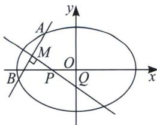
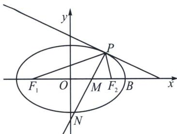

## 三、光学性质与中垂线截距定理

中垂线截距定理：若 A、B 关于直线 PQ 对称，可以知道线段 AB 被直线 PQ 垂直平分，其中 $P(n,0)$ ， $Q(0,m)$ 则能得出以下定理（不妨设焦点在 x 轴上）：

$m = -\frac{y_0c^2}{b^2}$ （椭圆）， $m = \frac{y_0c^2}{b^2}$ （双曲线）； $n = \frac{x_0c^2}{a^2}$ （椭圆）， $n = \frac{x_0c^2}{a^2}$ （双曲线）.

因为 $k_{AB} \cdot k_{OM} = -\frac{b^2}{a^2}$ (第三定义点差法), $k_{AB} \cdot k_{PQ} = -1$ , 所以 $\frac{k_{OM}}{k_{PQ}} = \frac{b^2}{a^2}$ , 故 $\frac{\frac{y_0}{x_0}}{\frac{y_0 - m}{x_0}} = \frac{b^2}{a^2}$ , 即 $m = -\frac{y_0c^2}{b^2}$ ; 同理 $\frac{\frac{y_0}{x_0}}{\frac{y_0}{x_0 - n}} = \frac{b^2}{a^2}$ , 即 $n = \frac{x_0c^2}{a^2}$ .

光学性质中垂线截距定理：

我们可以把切点 $P(x_{0}, y_{0})$ 看成二重点，如图，若 PM 为 $\angle F_{1}PF_{2}$ 平分线，则 $x_{M}=\frac{c^{2}x_{0}}{a^{2}}$ ， $y_{N}=-\frac{c^{2}y_{0}}{b^{2}}$ .

证明: 根据 $PM$ 为角平分线可知 $PM \perp l$ , ( $l$ 是椭圆在点 $P$ 处的切线), $PF_{2}$ 和 $PF_{1}$ 是入射光线和反射光线, 所以 $PM$ 是切线 (切点弦) $l$ 的中垂线 (考虑极限情况, 切点看为两个交点的中点), 故根据中垂线截距定理 $x_{M} = \frac{c^{2} x_{0}}{a^{2}}$ , $y_{N} = -\frac{c^{2} y_{0}}{b^{2}}$ .

![[高中/总复习/专题/2026版高中《mst老唐说题》圆锥曲线专题（数学）/上册/第03章_几何视角下的焦点三角形/第二节_几何光学性质下的焦点三角形/三_光学性质与中垂线截距定理/例题/Q00048487.md]]
![[高中/总复习/专题/2026版高中《mst老唐说题》圆锥曲线专题（数学）/上册/第03章_几何视角下的焦点三角形/第二节_几何光学性质下的焦点三角形/三_光学性质与中垂线截距定理/例题/Q00048488.md]]
![[高中/总复习/专题/2026版高中《mst老唐说题》圆锥曲线专题（数学）/上册/第03章_几何视角下的焦点三角形/第二节_几何光学性质下的焦点三角形/三_光学性质与中垂线截距定理/例题/Q00048489.md]]
