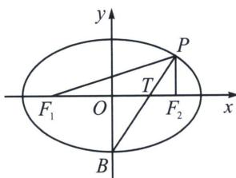

<!-- question-source:start -->
例7 (2024·福州模拟)已知 $F_{1}, F_{2}$ 分别是椭圆 $C: \frac{x^{2}}{a^{2}} + \frac{y^{2}}{b^{2}} = 1 (a > b > 0)$ 的左、右焦点, 过点 $F_{2}$ 作 $x$ 轴的垂线与椭圆 $C$ 在第一象限的交点为 $P$ , 若 $\angle F_{1}PF_{2}$ 的平分线经过椭圆 $C$ 的下顶点, 则椭圆 $C$ 的离心率的平方为 ( )
A. $\frac{\sqrt{3}-1}{2}$ B. $\frac{3-\sqrt{3}}{2}$ C. $\frac{3-\sqrt{5}}{2}$ D. $\frac{\sqrt{5}-1}{2}$

<!-- question-source:end -->

![[高中/总复习/专题/2026版高中《mst老唐说题》圆锥曲线专题（数学）/上册/第03章_几何视角下的焦点三角形/第二节_几何光学性质下的焦点三角形/三_光学性质与中垂线截距定理/例题/answers/Q00048487A1.md]]
