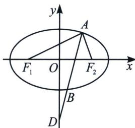

<!-- question-source:start -->
例9 (2023·MST 教师群探讨)如图, 椭圆焦点三角形的 $\angle F_{1}A F_{2}=90^{\circ}$ , $A B$ 为 $\angle F_{1}A F_{2}$ 的角平分线且 $\overrightarrow{A B}=2 \overrightarrow{B D}$ , 则椭圆离心率为 .

<!-- question-source:end -->

![[高中/总复习/专题/2026版高中《mst老唐说题》圆锥曲线专题（数学）/上册/第03章_几何视角下的焦点三角形/第二节_几何光学性质下的焦点三角形/三_光学性质与中垂线截距定理/例题/answers/Q00048489A1.md]]
