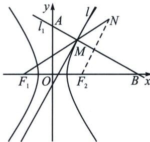

> [!faq]- 《圆锥曲线专题(上册)》例题解析
>
> > [!success]- **【答案】** ABD
>
> > [!note]- **【分析】**
> > 本题未单列分析。
>
> > [!note]- **【解析】**
> > 解析 A: 双曲线 $C_{1}: x^{2} - \frac{y^{2}}{2} = 1$ 的渐近线方程为 $y = \pm \sqrt{2} x$ , 而 $k \neq \pm \sqrt{2}$ , 又双曲线 $C_{1}: x^{2} - \frac{y^{2}}{2} = 1$ 与直线 $l: y = kx + m (k \neq \pm \sqrt{2})$ 有唯一公共点 $M$ , 则直线 $l$ 与双曲线相切, 由 $\left\{ \begin{array}{l} x^{2} - \frac{y^{2}}{2} = 1 \\ y = kx + m \end{array} \right.$ , 消去 $y$ 得 $(2 - k^{2})x^{2} - 2kmx - m^{2} - 2 = 0①$ , 由 $\Delta = 4k^{2}m^{2} + 4(2 - k^{2})(m^{2} + 2) = 0$ , 化简得 $k^{2} = m^{2} + 2$ , 故 A 正确;
> > 
> > B: 利用双曲线光学性质, 可知 $M$ , $N$ , $F_{1}$ 三点共线, 故 B 正确;
> > C: 由 A 可知 $x_{M}=\frac{km}{2-k^{2}}=-\frac{k}{m}$ (韦达)， $y_{M}=kx_{M}+m=\frac{k^{2}m}{2-k^{2}}+m=-\frac{(m^{2}+2)}{m}+m=-\frac{2}{m}$ ,
> > 利用中垂线定理， $x=\frac{c^{2}x_{M}}{a^{2}}=3x_{M}$ ， $y=\frac{c^{2}y_{M}}{b^{2}}=\frac{3y_{M}}{2}$ ，即 $A\left(-\frac{3k}{m},0\right)$ ， $B\left(0,-\frac{3}{m}\right)$ .
> > 当 $k = 2$ 时， $m = \pm \sqrt{2}$ ，不妨取 $m = \sqrt{2}$ ，则 $A(-3\sqrt{2}, 0)$ ， $B(0, -\frac{3\sqrt{2}}{2})$ ，此时 $S_{\triangle OAB} = \frac{1}{2} \times 3\sqrt{2} \times \frac{3\sqrt{2}}{2} = \frac{9}{2}$ ，故C错误；
> > D: 由选项 C 知, $P\left(-\frac{3k}{m}, -\frac{3}{m}\right)$ , 得 $x^{2} = 9 + \frac{18}{m^{2}} = 9 + 2 \cdot \frac{9}{m^{2}}, y^{2} = \frac{9}{m^{2}}$ , 所以 $x^{2} = 9 + 2y^{2}$ , 整理得 $\frac{x^{2}}{9} - \frac{y^{2}}{\frac{9}{2}} = 1$ , 为焦点在 $x$ 轴上且 $a^{2} = 9$ , $b^{2} = \frac{9}{2}$ 的双曲线, 其离心率为 $e = \frac{c}{a} = \frac{\sqrt{6}}{2}$ , 故 D 正确.
> >
> > 故选 **ABD**.
