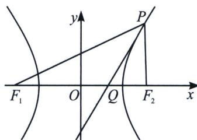

<!-- question-source:start -->
例2 已知点 $P$ 为双曲线上任一点， $F_{1}$ 、 $F_{2}$ 为椭圆的两焦点，求证双曲线在 $P$ 点处的切线与 $\angle F_{1}PF_{2}$ 的平分线重合.

<!-- question-source:end -->

![[高中/总复习/专题/2026版高中《mst老唐说题》圆锥曲线专题（数学）/上册/第03章_几何视角下的焦点三角形/第二节_几何光学性质下的焦点三角形/二_光学性质切线法线定理/例题/answers/Q00048482A1.md]]
