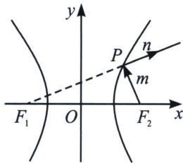
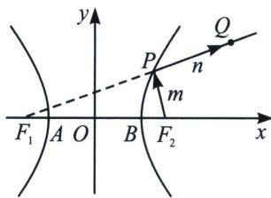

<!-- question-source:start -->
例4 (2024·多选·湖北月考)双曲线具有如下光学性质: 如图 $F_{1}$ , $F_{2}$ 是双曲线的左、右焦点, 从右焦点 $F_{2}$ 发出的光线 $m$ 交双曲线右支于点 $P$ , 经双曲线反射后, 反射光线 $n$ 的反向延长线过左焦点 $F_{1}$ . 若双曲线 $C$ 的方程为 $\frac{x^{2}}{9} - \frac{y^{2}}{16} = 1$ , 下列结论正确的是 ( )

A. 若 $m \perp n$ , 则 $|PF_1| \cdot |PF_2| = 16$

B. 当反射光线 n 过 Q(7, 5) 时，光由 $F_{2} \rightarrow P \rightarrow Q$ 所经过的路程为 7

C. 反射光线 n 所在直线的斜率为 k，则 $\left|k\right| \in \left[0, \frac{4}{3}\right)$

D. 记点 $T(1,0)$ , 直线 $PT$ 与 $C$ 相切, 则 $\left|PF_{2}\right|=12$
<!-- question-source:end -->

![[高中/总复习/专题/2026版高中《mst老唐说题》圆锥曲线专题（数学）/上册/第03章_几何视角下的焦点三角形/第二节_几何光学性质下的焦点三角形/二_光学性质切线法线定理/例题/answers/Q00048484A1.md]]
