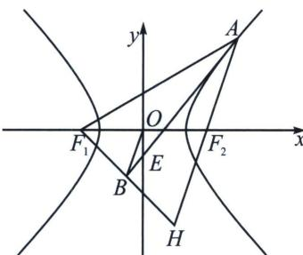
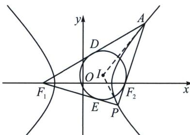

<!-- question-source:start -->
例6（2024·多选·濮阳一模）费马原理是几何光学中的一条重要定理，由此定理可以推导出圆锥曲线的一些性质，例如，若点 A 是双曲线 $C(F_{1}, F_{2}$ 为 C 的两个焦点）上的一点，则 C 在点 A 处的切线平分 $\angle F_{1}AF_{2}$ 。已知双曲线 $C: \frac{x^{2}}{8}-\frac{y^{2}}{4}=1$ 的左、右焦点分别为 $F_{1}, F_{2}$ ，直线 l 为 C 在其上一点 $A(4\sqrt{3}, 2\sqrt{5})$ 处的切线，则下列结论中正确的是（）

A. $C$ 的一条渐近线与直线 $\sqrt{2} x - y + 3 = 0$ 相互垂直

B. 若点 B 在直线 l 上，且 $F_{1}B \perp AB$ ，则 $|OB| = 2\sqrt{2}$ (O 为坐标原点)

C. 直线 l 的方程为 $\sqrt{3}x - \sqrt{5}y - 4 = 0$

D. 延长 $AF_{2}$ 交 $C$ 于点 $P$ , 则 $\triangle APF_{1}$ 的内切圆圆心在直线 $x = \frac{4\sqrt{3}}{3}$ 上

<!-- question-source:end -->

![[高中/总复习/专题/2026版高中《mst老唐说题》圆锥曲线专题（数学）/上册/第03章_几何视角下的焦点三角形/第二节_几何光学性质下的焦点三角形/二_光学性质切线法线定理/例题/answers/Q00048486A1.md]]
