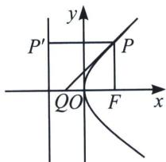

> [!faq]- 《圆锥曲线专题(上册)》例题解析
>
> > [!success]- **【答案】** 详见解析
>
> > [!note]- **【分析】**
> > 本题未单列分析。
>
> > [!note]- **【解析】**
> > 解析 证明：设双曲线方程为 $\frac{x^{2}}{a^{2}}-\frac{y^{2}}{b^{2}}=1(a>0,b>0)$ ，双曲线上一点 $P(x_{0},y_{0})$ 、 $F_{1}(-c,0)$ 、 $F_{2}(c,0)$ 。因为双曲线在P点处的切线力程为 $\frac{x_{0}x}{a^{2}}-\frac{y_{0}y}{b^{2}}=1$ （请自证），其斜率为 $\frac{b^{2}}{a^{2}}\cdot\frac{x_{0}}{y_{0}}$ ，又 $k_{PF_{1}}=\frac{y_{0}}{x_{0}+c}$ ， $k_{PF_{2}}=\frac{y_{0}}{x_{0}-c}$ ，
> > 解法一(夹角公式): $\tan \angle F_{1}PQ = \left|\frac{\frac{y_{0}}{x_{0} + c} - \frac{b^{2}x_{0}}{a^{2}y_{0}}}{1 + \frac{y_{0}}{x_{0} + c} \cdot \frac{b^{2}x_{0}}{a^{2}y_{0}}}\right| = \left|\frac{a^{2}y_{0}^{2} - b^{2}x_{0}^{2} - b^{2}cx_{0}}{(x_{0} + c)a^{2}y_{0} + b^{2}x_{0}y_{0}}\right| = \left|\frac{-b^{2}(cx_{0} + a^{2})}{cy_{0}(a^{2} + cx_{0})}\right| = \left|\frac{b^{2}}{cy_{0}}\right|$ .
> > $$
> > \tan \angle F _ {2} P Q = \left| \frac {\frac {y _ {0}}{x _ {0} - c} - \frac {b ^ {2} x _ {0}}{a ^ {2} y _ {0}}}{1 + \frac {y _ {0}}{x _ {0} - c} \cdot \frac {b ^ {2} x _ {0}}{a ^ {2} y _ {0}}} \right| = \left| \frac {a ^ {2} y _ {0} ^ {2} - b ^ {2} x _ {0} ^ {2} + b ^ {2} c x _ {0}}{(x _ {0} - c) a ^ {2} y _ {0} + b ^ {2} x _ {0} y _ {0}} \right| = \left| \frac {b ^ {2} (c x _ {0} - a ^ {2})}{c y _ {0} (c x _ {0} - a ^ {2})} \right| = \left| \frac {b ^ {2}}{c y _ {0}} \right|.
> > $$
> > 即有 $\tan\angle F_{1}PQ=\tan\angle F_{2}PQ$ ，知直线 PQ 是 $\angle F_{1}PF_{2}$ 的平分线.
> > 解法二(焦半径公式): 易求得 $PQ$ 方程为 $\frac{x_0x}{a^2} - \frac{y_0y}{b^2} = 1$ , 当 $y = 0$ 时, $x_Q = \frac{a^2}{x_0}$ ,
> > 根据焦半径公式 $|PF_1| = ex_0 + a$ ， $|PF_2| = ex_0 - a$ ， $\frac{|PF_1|}{|PF_2|} = \frac{a + ex_0}{-a + ex_0} = \frac{a^2 + cx_0}{-a^2 + cx_0}$ ， $\frac{|F_1Q|}{|F_2Q|} = \frac{\frac{a^2}{x_0} + c}{c - \frac{a^2}{x_0}} = \frac{a^2 + cx_0}{cx_0 - a^2}$ 所以 $\frac{|PF_1|}{|PF_2|} = \frac{|F_1Q|}{|F_2Q|}$ ，故根据角平分线判定定理可得直线 $PQ$ 是 $\angle F_{1}PF_{2}$ 的平分线.
> > 定理 3: 点 P 为抛物线上任一点, F 为抛物线的焦点, 过 P 作抛物线的准线的垂线, 垂足为 $P'$ , 则抛物线在点 P 处的切线与 $\angle FPP'$ 的平分线重合.
> > 证明：设抛物线的方程为 $y^{2}=2px,\quad P\left(\frac{y_{0}^{2}}{2p},y_{0}\right)$ . 利用导数知识易得抛物线在 P 点处的切线斜率存在时为 $k_{PQ}=\frac{p}{y_{0}}$ . 又 $F\left(\frac{p}{2},0\right)$ ，则 $k_{FP}=\frac{2py_{0}}{y_{0}^{2}-p^{2}},k_{PP'}=0$ .
> > 
> > 由夹角公式可得： $\tan \angle QPP^{\prime} = \left|\frac{k_{PP^{\prime}} - k_{PQ}}{1 + k_{PP^{\prime}}k_{PQ}}\right| = \left|\frac{p}{y_0}\right|$ ， $\tan \angle FPQ = \left|\frac{k_{FP} - k_{PQ}}{1 + k_{FP}k_{PQ}}\right| = \left|\frac{\frac{2py_0}{y_0^2 - p^2} - \frac{p}{y_0}}{1 + \frac{2py_0}{y_0^2 - p^2} \cdot \frac{p}{y_0}}\right|$
> > $$
> > = \left| \frac {p y _ {0} ^ {2} - p ^ {3} - 2 p y _ {0} ^ {2}}{y _ {0} \left(y _ {0} ^ {2} - p ^ {2}\right)} \cdot \frac {y _ {0} ^ {2} - p ^ {2}}{y _ {0} ^ {2} - p ^ {2} + 2 p ^ {2}} \right| = \left| \frac {- p ^ {3} - p y _ {0} ^ {2}}{y _ {0}} \cdot \frac {1}{y _ {0} ^ {2} + p ^ {2}} \right| = \left| \frac {- p \left(p ^ {2} + y _ {0} ^ {2}\right)}{y _ {0}} \cdot \frac {1}{y _ {0} ^ {2} + p ^ {2}} \right| = \left| \frac {p}{y _ {0}} \right|.
> > $$
> > 即有 $\tan\angle QPP'=\tan\angle FPQ$ ，所以 PQ 为 $\angle FPP'$ 的平分线.
