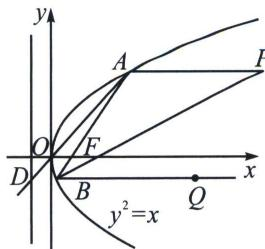

> [!faq]- 《圆锥曲线专题(上册)》例题解析
>
> > [!success]- **【答案】** ACD
>
> > [!note]- **【解析】**
> > 解析 如图，由抛物线 C: $y^{2}=x$ ，得其焦点为 $F\left(\frac{1}{4},0\right)$ ，准线方程为 $x=-\frac{1}{4}$ .
> >
> > 
> >
> > 由抛物线的光学性质得 PAx 轴，直线 AB 过点 F，BQx 轴.
> >
> > 因为 $P\left(\frac{41}{16}, 1\right)$ ，所以 $y_{1} = 1$ ，即 $A(x_{1}, 1)$ ，代入 $C: y^{2} = x$ ，得 $x_{1} = 1$ ，则 $A(1, 1)$ ，
> >
> > 所以直线 AF 的斜率 $k_{AF}=\frac{1}{1-\frac{1}{4}}=\frac{4}{3}$ ，故直线 AF 的方程为 $y=\frac{4}{3}\left(x-\frac{1}{4}\right)$ ，即 4x-3y-1=0.
> >
> > 由 $\left\{\begin{aligned}4x-3y-1=0\\ y^{2}=x\end{aligned}\right.$ ，解得 $\left\{\begin{aligned}x=1\\ y=1\end{aligned}\right.$ ，或 $\left\{\begin{aligned}x=\frac{1}{16}\\ y=-\frac{1}{4}\end{aligned}\right.$ ，所以 $B\left(\frac{1}{16},-\frac{1}{4}\right)$ .
> >
> > 对于 A， $|PA|=\frac{41}{16}-1=\frac{25}{16}$ ， $|AB|=\sqrt{\left(1-\frac{1}{16}\right)^{2}+\left(1+\frac{1}{4}\right)^{2}}=\frac{25}{16}$ ，故 $|PA|=|AB|$ ，所以 $\angle APB=\angle ABP$ .
> >
> > 又因为 $PA \parallel x$ 轴, $BQ \parallel x$ 轴, 所以 $PA \parallel BQ$ , 故 $\angle APB = \angle PBQ$ , 所以 $\angle ABP = \angle PBQ$ , 即 $BP$ 平分 $\angle ABQ$ , 故 A 正确.
> >
> > 对于 B，因为 $y_{1}=1,\quad y_{2}=-\frac{1}{4}$ ，所以 $y_{1}y_{2}=-\frac{1}{4}$ ，故 B 错误.
> >
> > 对于 C，因为 $A(1,1)$ ，所以直线 AO 的方程为 y=x，由 $\left\{\begin{aligned}y&=x,\\ x&=-\frac{1}{4},\end{aligned}\right.$ 得直线 AO 与抛物线 C 的准线的交点为 $D\left(-\frac{1}{4},-\frac{1}{4}\right)$ ，又 BQx 轴， $B\left(\frac{1}{16},-\frac{1}{4}\right)$ ，所以直线 BQ 与抛物线 C 的准线的交点为 $\left(-\frac{1}{4},-\frac{1}{4}\right)$ ，即点 D，则直线 AO，直线 BQ 与抛物线 C 的准线相交于同一点，故 C 正确。
> >
> > 对于D，点 $B\left(\frac{1}{16},-\frac{1}{4}\right)$ 关于y轴的对称点为 $B'\left(-\frac{1}{16},-\frac{1}{4}\right)$ ，所以 $|MA|+|MB|=|MA|+|MB'|$ ，当 $|MA|+|MB'|$ 最小时，点M在直线 $AB'$ 上，因为 $k_{AB'}=\frac{1+\frac{1}{4}}{1+\frac{1}{16}}=\frac{20}{17}$ ，所以直线 $AB'$ 为 $y-1=\frac{20}{17}(x-1)$ ，即 $y=\frac{20}{17}x-\frac{3}{17}$ ，当x=0时， $y=-\frac{3}{17}$ ，所以点M的坐标为 $(0,-\frac{3}{17})$ 。故D正确。
> >
> > 故选 **ACD**。
