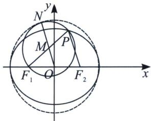
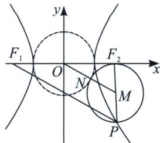
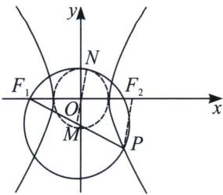
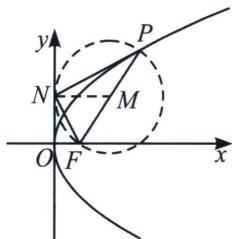

## 一、以圆锥曲线焦半径为直径的圆的性质

(1) 以椭圆的焦半径为直径的圆必与大圆(以长轴为直径的圆)相内切.

(2) 以双曲线的焦半径为直径的圆必与小圆(以实轴为直径的圆)相切.

(3) 以抛物线 $y^{2}=2px$ 的焦半径为直径的圆必与 y 轴相切.

证明：（1）如左图，以椭圆 $\frac{x^{2}}{a^{2}}+\frac{y^{2}}{b^{2}}=1(a>b>0)$ 为例， $F_{1}$ 、 $F_{2}$ 分别为左、右焦点，以焦半径 $\left|PF_{1}\right|$ 为直径的圆M，连结OM并延长交圆M于N、连接 $\left|PF_{2}\right|$ ，易知 $|OM|=\frac{1}{2}\left|PF_{2}\right|$ ， $|MN|=\frac{1}{2}\left|PF_{1}\right|$ ，所以 $|ON|=\frac{1}{2}\left(\left|PF_{1}\right|+\left|PF_{2}\right|\right)=a$ ，所以以椭圆的焦半径为直径的圆必与大圆（以长轴为直径的圆）内切.

(2) 如中图, 以双曲线 $\frac{x^{2}}{a^{2}} - \frac{y^{2}}{b^{2}} = 1 (a > 0, b > 0)$ 为例, $F_{1} 、 F_{2}$ 分别为左、右焦点, 以焦半径 $|PF_{2}|$ 为直径的圆 $M$ , 连结 $OM$ 并与圆 $M$ 交于 $N$ 、连接 $|PF_{1}|$ , 易知 $|OM| = \frac{1}{2} |PF_{1}|$ , $|MF_{2}| = \frac{1}{2} |PF_{2}|$ , 所以 $|ON| = \frac{1}{2} (|PF_{1}| - |PF_{2}|) = a$ , 因此, 以双曲线的短焦半径为直径的圆必与小圆 (以实轴为直径的圆) 外切.

如右图，以焦半径 $|PF_{1}|$ 为直径的圆 $M$ ，连结 $OM$ 并反向延长交圆 $M$ 于 $N$ 、连接 $|PF_{2}|$ ，易知 $|OM| = \frac{1}{2}|PF_{2}|$ ， $|MF_{1}| = \frac{1}{2}|PF_{1}|$ ，所以 $|ON| = \frac{1}{2} (|PF_{1}| - |PF_{2}|) = a$ ，因此，以双曲线的长焦半径为直径的圆必与小圆（以实轴为直径的圆）内切.

(3)如图, 以抛物线 $y^{2} = 2px (p > 0)$ 为例, $F$ 为焦点, 以焦半径 $|PF|$ 为直径的圆 $M$ , 作 $MN \perp y$ 轴于 $N$ , $|PF| = x_{0} + \frac{p}{2}$ , $|MN| = x_{M} = \frac{x_{0} + \frac{p}{2}}{2} = \frac{|PF|}{2}$ , 故以 $|PF|$ 为直径的圆 $M$ 和 $y$ 轴相切.

![[高中/总复习/专题/2026版高中《mst老唐说题》圆锥曲线专题（数学）/上册/第03章_几何视角下的焦点三角形/第四节_焦点三角形与大小圆问题/一_以圆锥曲线焦半径为直径的圆的性质/例题/Q00048505.md]]
![[高中/总复习/专题/2026版高中《mst老唐说题》圆锥曲线专题（数学）/上册/第03章_几何视角下的焦点三角形/第四节_焦点三角形与大小圆问题/一_以圆锥曲线焦半径为直径的圆的性质/例题/Q00048506.md]]
![[高中/总复习/专题/2026版高中《mst老唐说题》圆锥曲线专题（数学）/上册/第03章_几何视角下的焦点三角形/第四节_焦点三角形与大小圆问题/一_以圆锥曲线焦半径为直径的圆的性质/例题/Q00048507.md]]
![[高中/总复习/专题/2026版高中《mst老唐说题》圆锥曲线专题（数学）/上册/第03章_几何视角下的焦点三角形/第四节_焦点三角形与大小圆问题/一_以圆锥曲线焦半径为直径的圆的性质/例题/Q00048508.md]]
![[高中/总复习/专题/2026版高中《mst老唐说题》圆锥曲线专题（数学）/上册/第03章_几何视角下的焦点三角形/第四节_焦点三角形与大小圆问题/一_以圆锥曲线焦半径为直径的圆的性质/例题/Q00048509.md]]
