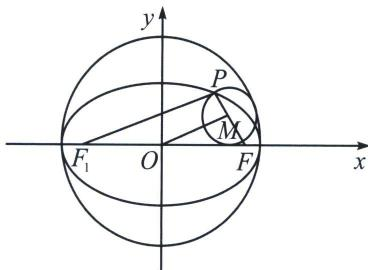

<!-- question-source:start -->
例1 (2023·岳麓区期末) $F$ 是椭圆 $E: \frac{x^{2}}{a^{2}} + \frac{y^{2}}{b^{2}} = 1$ 的右焦点, $P$ 是该椭圆上任一点, 以 $PF$ 为直径作圆

5 老唐说题

$C_{1}$ ，以椭圆长轴为直径作圆 $C_{2}$ ，则圆 $C_{1}$ 与圆 $C_{2}$ 的位置关系是 \_\_\_\_.

<!-- question-source:end -->

![[高中/总复习/专题/2026版高中《mst老唐说题》圆锥曲线专题（数学）/上册/第03章_几何视角下的焦点三角形/第四节_焦点三角形与大小圆问题/一_以圆锥曲线焦半径为直径的圆的性质/例题/answers/Q00048505A1.md]]
