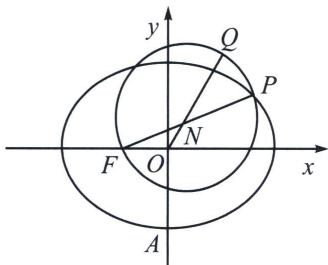
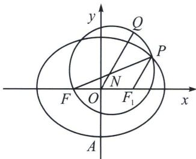

<!-- question-source:start -->
例3 (2023·天山区期末)如图, 已知 $F$ 是椭圆 $\frac{x^{2}}{4}+\frac{y^{2}}{3}=1$ 的左焦点, $A$ 为椭圆的下顶点, 点 $P$ 是椭圆上任意一点, 以 $PF$ 为直径作圆 $N$ , 射线 $ON$ 与圆 $N$ 交于点 $Q$ , 则 $|AQ|$ 的取值范围为 \_\_\_\_.

<!-- question-source:end -->

![[高中/总复习/专题/2026版高中《mst老唐说题》圆锥曲线专题（数学）/上册/第03章_几何视角下的焦点三角形/第四节_焦点三角形与大小圆问题/一_以圆锥曲线焦半径为直径的圆的性质/例题/answers/Q00048507A1.md]]
