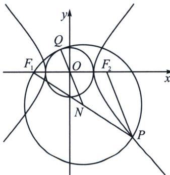

<!-- question-source:start -->
例4 (2024·大连模拟)已知 $F_{1}$ 、 $F_{2}$ 是双曲线 $C: \frac{x^{2}}{4} - \frac{y^{2}}{5} = 1$ 的左、右焦点，点 $P(x_{0}, y_{0})(x_{0} \geqslant 3)$ 是双曲线 $C$ 上任意一点，以 $PF_{1}$ 为直径作圆 $N$ ，NO延长线与圆 $N$ 交于点 $Q$ ，则 $\overrightarrow{Q F_{1}} \cdot \overrightarrow{Q F_{2}} =$ （ ）A. 9 B. 4 C. -4 D. -5

<!-- question-source:end -->

![[高中/总复习/专题/2026版高中《mst老唐说题》圆锥曲线专题（数学）/上册/第03章_几何视角下的焦点三角形/第四节_焦点三角形与大小圆问题/一_以圆锥曲线焦半径为直径的圆的性质/例题/answers/Q00048508A1.md]]
