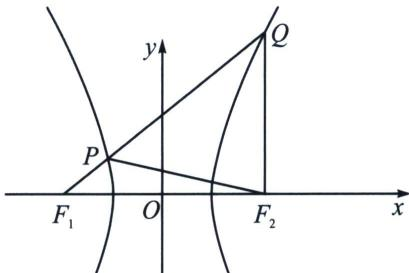

<!-- question-source:start -->
例5 (2024·多选·安徽模拟)已知双曲线 $C: \frac{x^{2}}{a^{2}} - \frac{y^{2}}{b^{2}} = 1 (a > 0, b > 0)$ 左右焦点分别为 $F_{1}, F_{2}$ , $|F_{1}F_{2}| = 4\sqrt{7}$ . 经过 $F_{1}$ 的直线 $l$ 与 $C$ 的左右两支分别交于 $P, Q$ , 且 $\triangle PQF_{2}$ 为等边三角形, 则 ( )

A. 双曲线 $C$ 的方程为 $\frac{x^{2}}{8} - \frac{y^{2}}{20} = 1$ B. $\triangle PF_{1}F_{2}$ 的面积为 $8\sqrt{3}$ C. 以 $QF_{1}$ 为直径的圆与以实轴为直径的圆相交 D. 以 $QF_{2}$ 为直径的圆与以实轴为直径的圆相切

<!-- question-source:end -->

![[高中/总复习/专题/2026版高中《mst老唐说题》圆锥曲线专题（数学）/上册/第03章_几何视角下的焦点三角形/第四节_焦点三角形与大小圆问题/一_以圆锥曲线焦半径为直径的圆的性质/例题/answers/Q00048509A1.md]]
