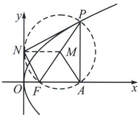

> [!faq]- 《圆锥曲线专题(上册)》例题解析
>
> > [!success]- **【答案】** D
>
> > [!note]- **【解析】**
> > 解析 解法一：设以 PF 为直径的圆与 x 轴交点为 A，则 $\left|AF\right|=1,\quad\left|PF\right|=5$ ，连接 PA，则 $\angle PAF=90^{\circ}$ ，
> >
> > 所以 $|PA| = \sqrt{|PF|^2 - |AF|^2} = \sqrt{5^2 - 1^2} = 2\sqrt{6}$ ，所以 $y_P = 2\sqrt{6}$ ，把 $y = 2\sqrt{6}$ ，代入 $y^2 = 2px$ ，得 $x = \frac{12}{p}$ ，所以 $x_P = \frac{12}{p}$ ，所以 $\frac{12}{p} - \left(-\frac{p}{2}\right) = |PF|$ ，即 $\frac{12}{p} + \frac{p}{2} = 5$ ，所以 $p^2 - 10p + 24 = 0$ ，解得 $p = 4$ 或6，
> >
> > 
> >
> > 解法二：易知 $|PF| = x_0 + \frac{p}{2} = 5$ ，以 $PF$ 为直径的圆与 $y$ 轴相切， $|AF| = \left|x_0 - \frac{p}{2}\right| = 1$ ，解得： $\begin{cases} x_0 = 3 \\ p = 4 \end{cases}$ 或 $\begin{cases} x_0 = 2 \\ p = 6 \end{cases}$
> >
> > 故选 **D**.
