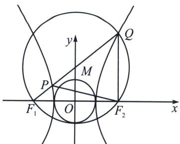
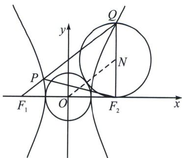

> [!faq]- 《圆锥曲线专题(上册)》例题解析
>
> > [!success]- **【答案】** BD
>
> > [!note]- **【分析】**
> > 本题未单列分析。
>
> > [!note]- **【解析】**
> > 解析 对于 A，由 $\triangle PQF_{2}$ 为等边三角形，得 $PQ=PF_{2}=QF_{2}$ ，由双曲线定义知， $PF_{1}=QF_{1}-QP=QF_{1}-QF_{2}=2a,\quad PF_{2}-PF_{1}=2a$ ，所以 $PF_{2}=PF_{1}+2a=4a,\quad QF_{2}=4a,\quad QF_{1}=6a$ 在 $\triangle QF_{1}F_{2}$ 中，由余弦定理得， $16a^{2}+36a^{2}-2\times24a^{2}\times\frac{1}{2}=16\times7$ ，解得 $a^{2}=4$ ，所以 $b^{2}=24$ ，
> > 方程为 $\frac{x^{2}}{4}-\frac{y^{2}}{24}=1$ ，选项A错误.
> > 对于 B， $\triangle PF_{1}F_{2}$ 的面积为 $S=\frac{1}{2}\times8a^{2}=\frac{\sqrt{3}}{2}=8\sqrt{3}$ ，选项 B 正确.
> > 
> > 
> > 对于 C，取 $QF_{1}$ 的中点 M， $OM=\frac{1}{2}QF_{2}=\frac{1}{2}(QF_{1}-2a)=\frac{1}{2}QF_{1}-a$ ，两圆内切，选项 C 错误.
> > 对于 D，取 $QF_{2}$ 的中点 N，则 $ON=\frac{1}{2}QF_{1}=\frac{1}{2}(QF_{2}+2a)=\frac{1}{2}QF_{2}+a$ ，两圆外切，选项 D 正确。
> >
> > 故选 **BD**.
