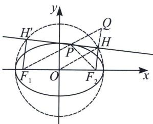

## 二、光学定理与大圆小圆问题

## 1. 椭圆的大圆

过焦点作椭圆切线的垂线，垂足轨迹是以长轴为直径的圆．这个圆我们称之为大圆.

如图，已知椭圆 $\frac{x^2}{a^2} +\frac{y^2}{b^2} = 1(a > b > 0)$ 上点 $P$ 处的切线为 $l$ ，则过焦点 $F_{1}$ 、 $F_{2}$ 作直线 $l$ 的垂线，垂足 $H$ 的轨迹是以长轴为直径的圆，即为 $x^{2} + y^{2} = a^{2}$

证明：如图，作 $F_{2}H \perp l$ ， $F_{1}H^{\prime} \perp l$ 。当点 $P$ 不在长轴的两个端点时，延长 $F_{1}P$ 交 $F_{2}H$ 于点 $Q$ ，根据椭圆的光学性质可知：切线 $l$ 平分 $\angle F_{2}PQ$ ，故 $\triangle PQF_{2}$ 是等腰三角形，点 $H$ 是线段 $F_{2}Q$ 的中点。因此，在 $F_{1}F_{2}Q$ 中， $|OH| = \frac{|F_{1}Q|}{2} = \frac{|F_{1}P| + |PQ|}{2} = \frac{|F_{1}P| + |PF_{2}|}{2} = a$ ，故点 $H$ 的轨迹是 $x^{2} + y^{2} = a^{2} (x \neq \pm a)$ ，当点 $P$ 在长轴的两个端点时，此时的射影点 $(\pm a, 0)$ 亦满足上述方程。

![[高中/总复习/专题/2026版高中《mst老唐说题》圆锥曲线专题（数学）/上册/第03章_几何视角下的焦点三角形/第四节_焦点三角形与大小圆问题/二_光学定理与大圆小圆问题/例题/Q00048510.md]]
![[高中/总复习/专题/2026版高中《mst老唐说题》圆锥曲线专题（数学）/上册/第03章_几何视角下的焦点三角形/第四节_焦点三角形与大小圆问题/二_光学定理与大圆小圆问题/例题/Q00048511.md]]
