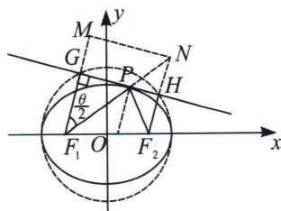
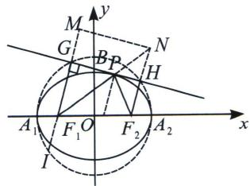

<!-- question-source:start -->
例6 (2023·连城县月考)如图所示, 已知 $F_{1}, F_{2}$ 是椭圆 $\Gamma: \frac{x^{2}}{a^{2}} + \frac{y^{2}}{b^{2}} = 1 (a > b > 0)$ 的左, 右焦点, $P$ 是椭圆 $\Gamma$ 上任意一点, 过 $F_{2}$ 作 $\angle F_{1}PF_{2}$ 的外角的角平分线的垂线, 垂足为 $Q$ , 则点 $Q$ 的轨迹为 ( )

A. 直线 B. 圆 C. 椭圆 D. 双曲线

(1) $\left|F_{1}G\right|\cdot\left|F_{2}H\right|=b^{2};$

(2) 直角梯形 $F_{1}F_{2}HG$ 的面积的为 $S=a^{2}\sin\theta$ ，又 $\theta\leqslant\angle F_{1}BF_{2}$ ，故 $S_{\max}=\left\{\begin{aligned}&a^{2},\quad\left(\angle F_{1}BF_{2}\geqslant\frac{\pi}{2}\right)\\&2bc,\quad\left(0<\angle F_{1}BF_{2}<\frac{\pi}{2}\right)\end{aligned}\right.$ ;

证明：
（1）解法一：设 $|F_1P| = m$ ， $|F_{2}P| = n$ ，则 $|F_1G| = |PF_1|\cos \frac{\theta}{2}, |F_2H| = |PF_2|\cos \frac{\theta}{2}$

$$
\left| F _ {1} G \right| \cdot \left| F _ {2} H \right| = m n \cdot \cos^ {2} \frac {\theta}{2} = m n \cdot \frac {1 + \cos \theta}{2} = m n \cdot \frac {1 + \frac {m ^ {2} + n ^ {2} - 4 c ^ {2}}{2 m n}}{2} = \frac {(m + n) ^ {2} - 4 c ^ {2}}{4} = b ^ {2}.
$$

(2) 利用椭圆的光学性质, 如图所示, 延长 $F_{1} P$ 交 $F_{2} H$ 于点 $N$ , 过点 $N$ 作 $M N \parallel G H$ 交 $F_{1} G$ 延长线于点 $M$ , 因此, $S = \frac{1}{2} (|F_{1} G| + |F_{2} H|)|MN| = \frac{1}{2} (|F_{1} G| + |MG|)|MN| = \frac{1}{2}|F_{1} M| \cdot |MN| = \frac{1}{2}|F_{1} N|^{2}$ . $\sin \frac{\theta}{2} \cos \frac{\theta}{2}$ , 又 $|F_{1} N| = |F_{1} P| + |PF_{2}| = 2a$ , 则 $S = \frac{1}{2} \cdot 4a^{2} \sin \frac{\theta}{2} \cdot \cos \frac{\theta}{2} = a^{2} \sin \theta$ .
<!-- question-source:end -->

![[高中/总复习/专题/2026版高中《mst老唐说题》圆锥曲线专题（数学）/上册/第03章_几何视角下的焦点三角形/第四节_焦点三角形与大小圆问题/二_光学定理与大圆小圆问题/例题/answers/Q00048510A1.md]]
