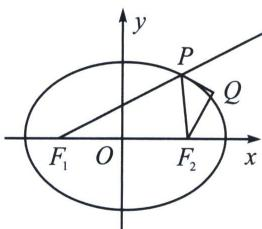
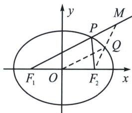

<!-- question-source:start -->
例6 (2023·连城县月考)如图所示, 已知 $F_{1}, F_{2}$ 是椭圆 $\Gamma: \frac{x^{2}}{a^{2}} + \frac{y^{2}}{b^{2}} = 1 (a > b > 0)$ 的左, 右焦点, $P$ 是椭圆 $\Gamma$ 上任意一点, 过 $F_{2}$ 作 $\angle F_{1}PF_{2}$ 的外角的角平分线的垂线, 垂足为 $Q$ , 则点 $Q$ 的轨迹为 ( )

A. 直线 B. 圆 C. 椭圆 D. 双曲线
<!-- question-source:end -->

![[高中/总复习/专题/2026版高中《mst老唐说题》圆锥曲线专题（数学）/上册/第03章_几何视角下的焦点三角形/第四节_焦点三角形与大小圆问题/二_光学定理与大圆小圆问题/例题/answers/Q00052981A1.md]]
