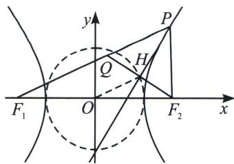

> [!faq]- 《圆锥曲线专题(上册)》例题解析
>
> > [!success]- **【答案】** 详见解析
>
> > [!note]- **【分析】**
> > 本题未单列分析。
>
> > [!note]- **【解析】**
> > 解析 $|MF_{1}| \cdot |NF_{2}| = b^{2} = 3$ ，故答案为3.
> > ## 3. 双曲线的小圆
> > 焦点在双曲线切线上的垂足轨迹是以实轴为直径的圆，我们称之为小圆。
> > 如图，已知双曲线 $\frac{x^2}{a^2} -\frac{y^2}{b^2} = 1(a > 0,b > 0)$ 上点 $P$ 处的切线为 $l$ ，则焦点 $F_{1}$ 、 $F_{2}$ 在直线 $l$ 上的射影点 $H$ 的轨迹是以实轴为直径的圆，即为 $x^{2} + y^{2} = a^{2}$
> > 
> > 证明：如图，点 $P$ 在右支，以右焦点 $F_{2}$ 为例证明，作 $F_{2}H \perp l$ 。当点 $P$ 不在长轴的两个端点时，延长 $F_{2}H$ 交 $F_{1}P$ 于点 $Q$ ，根据双曲线的光学性质可知：切线 $l$ 平分 $\angle F_{1}PF_{2}$ ，由于在 $\triangle PQF_{2}$ 中，线段 $PH$ 既是角平分线又是高，因此， $\triangle PQF_{2}$ 是等腰三角形，进而点 $H$ 是线段 $F_{2}Q$ 的中点。因此，在 $F_{1}F_{2}Q$ 中， $|OH| = \frac{1}{2} |QF_{1}| = \frac{1}{2} (|PF_{1}| - |PF_{2}|) = a$ ，故点 $H$ 的轨迹是 $x^{2} + y^{2} = a^{2} (x \neq \pm a)$ 。当 $P$ 为长轴端点时也满足。
