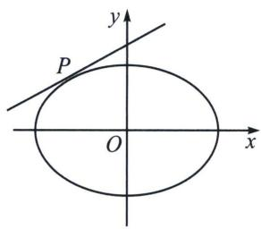
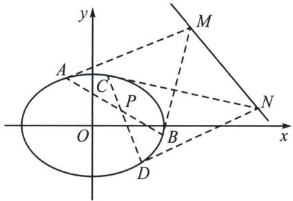
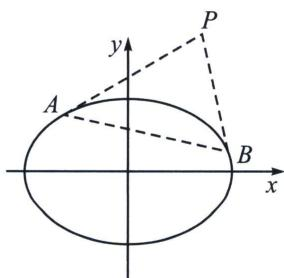
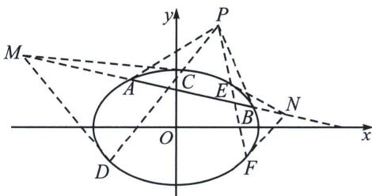

## 一、切线与切点弦的极点极线方程

## 1. 二次曲线的替换法则

对于一般式的二次曲线 $\varphi: Ax^{2} + Bxy + Cy^{2} + Dx + Ey + F = 0$ ，用 $xx_{0}$ 代 $x^{2}$ ，用 $yy_{0}$ 代 $y^{2}$ ，用 $\frac{x_{0}y + xy_{0}}{2}$ 代 xy，用 $\frac{x + x_{0}}{2}$ 代 x，用 $\frac{y + y_{0}}{2}$ 代 y，常数项不变，

可得方程： $Axx_{0}+B\cdot\frac{x_{0}y+xy_{0}}{2}+Cyy_{0}+D\cdot\frac{x+x_{0}}{2}+E\cdot\frac{y+y_{0}}{2}+F=0.$

## 2. 切线切点弦的极点极线代数定义

高中阶段，常见的二次曲线的极点极线方程如下：

(1)圆：

①极点 $P(x_{0}, y_{0})$ 关于圆 $x^{2} + y^{2} = r^{2}$ 的极线方程是 $xx_{0} + yy_{0} = r^{2}$ ;

②极点 $P(x_{0}, y_{0})$ 关于圆 $(x-a)^{2}+(y-b)^{2}=r^{2}$ 的极线方程是 $(x-a)(x_{0}-a)+(y-b)(y_{0}-b)=r^{2}$ ;

③极点 $P(x_0, y_0)$ 关于圆 $x^2 + y^2 + Dx + Ey + F = 0$ 的极线方程是： $xx_0 + yy_0 + D \cdot \frac{x + x_0}{2} + E \cdot \frac{y + y_0}{2} + F = 0.$

(2)椭圆：

极点 $P(x_{0}, y_{0})$ 关于椭圆 $\frac{x^{2}}{a^{2}} + \frac{y^{2}}{b^{2}} = 1$ 的极线方程是： $\frac{xx_{0}}{a^{2}} + \frac{yy_{0}}{b^{2}} = 1$ .

(3)双曲线：

极点 $P(x_{0}, y_{0})$ 关于双曲线 $\frac{x^{2}}{a^{2}} - \frac{y^{2}}{b^{2}} = 1$ 的极线方程是： $\frac{xx_{0}}{a^{2}} - \frac{yy_{0}}{b^{2}} = 1$ .

(4)抛物线

极点 $P(x_{0}, y_{0})$ 关于抛物线 $y^{2}=2px$ 的极线方程是： $y_{0}y=p(x+x_{0})$

## 3. 切线切点弦的几何意义

(1)若极点 P 在二次曲线上，则极线是过点 P 的切线方程.

(2)若极点 $P$ 在二次曲线内部, 则极线是过点 $P$ 的弦两端端点的切线交点的轨迹. 如图所示, 过点 $P$ 的弦 $A B 、 C D$ 的两端端点作切线, 得到的直线 $M N$ 即为点 $P$ 对应的极线轨迹. 【极线和二次曲线必定相离】

(3)若极点 $P$ 在二次曲线外部, 分成两种情况:

①极线在二次曲线内的部分是点 P 对二次曲线的切点弦；【极线和二次曲线必定相交】

②极线在二次曲线外的部分是过点 P 的弦两端端点的切线交点的轨迹(也在切点弦上).

![[高中/总复习/专题/2026版高中《mst老唐说题》圆锥曲线专题（数学）/上册/第04章_小题新题型与多选的综合题方法篇/第一节_切线与切点弦/一_切线与切点弦的极点极线方程/例题/Q00048512.md]]
![[高中/总复习/专题/2026版高中《mst老唐说题》圆锥曲线专题（数学）/上册/第04章_小题新题型与多选的综合题方法篇/第一节_切线与切点弦/一_切线与切点弦的极点极线方程/例题/Q00048513.md]]
![[高中/总复习/专题/2026版高中《mst老唐说题》圆锥曲线专题（数学）/上册/第04章_小题新题型与多选的综合题方法篇/第一节_切线与切点弦/一_切线与切点弦的极点极线方程/例题/Q00048514.md]]
![[高中/总复习/专题/2026版高中《mst老唐说题》圆锥曲线专题（数学）/上册/第04章_小题新题型与多选的综合题方法篇/第一节_切线与切点弦/一_切线与切点弦的极点极线方程/例题/Q00048515.md]]
