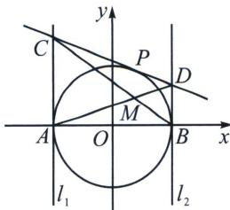

<!-- question-source:start -->
例3 (2025·辽宁鞍山·二模)如图, 圆 $O: x^{2} + y^{2} = 4$ 与 $x$ 轴交于 $A 、 B$ 两点, $l_{1} 、 l_{2}$ 是分别过 $A 、 B$ 的圆 $O$ 的切线, 过圆 $O$ 上任意一点 $P$ 作圆 $O$ 的切线, 分别交 $l_{1} 、 l_{2}$ 于点 $C 、 D$ 两点, 记直线 $A D$ 与 $B C$ 交于

点 $M$ ，则点 $M$ 的轨迹方程为

( )

A. $x^{2} + y^{2} = 1(y\neq 0)$ B. $\frac{x^2}{4} +y^2 = 1(y\neq 0)$ C. $x^{2} + y^{2} = 2(y\neq 0)$ D. $\frac{x^2}{4} +\frac{y^2}{2} = 1(y\neq 0)$
<!-- question-source:end -->

![[高中/总复习/专题/2026版高中《mst老唐说题》圆锥曲线专题（数学）/上册/第04章_小题新题型与多选的综合题方法篇/第一节_切线与切点弦/一_切线与切点弦的极点极线方程/例题/answers/Q00048514A1.md]]
