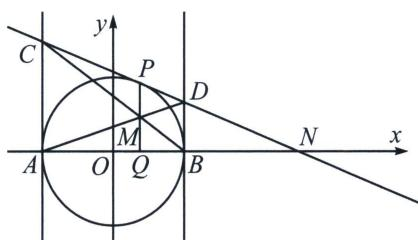

> [!faq]- 《圆锥曲线专题(上册)》例题解析
>
> > [!success]- **【答案】** B
>
> > [!note]- **【分析】**
> > 本题未单列分析。
>
> > [!note]- **【解析】**
> > 解析 解法一：设点 $P(x_0, y_0)$ ，切线 $CD$ 的方程为 $x_0x + y_0y = r^2 = x_0^2 + y_0^2$ ，又点 $P$ 在圆 $O$ 上，所以 $x_0^2 + y_0^2 = 4$ ，故切线 $CD$ 的方程为 $x_0x + y_0y = 4$ 。易知 $A(-2, 0)$ ， $B(2, 0)$ ，在切线 $CD$ 的方程中，令 $x = -2$ ，则 $y = \frac{4 + 2x_0}{y_0}$ ，令 $x = 2$ ，则 $y = \frac{4 - 2x_0}{y_0}$ ，所以 $C\left(-2, \frac{4 + 2x_0}{y_0}\right), D\left(2, \frac{4 - 2x_0}{y_0}\right)$ ，所以直线 $AD$ 的斜率 $k_{AD} = \frac{\frac{4 - 2x_0}{y_0}}{2 - (-2)} = \frac{2 - x_0}{2y_0}$ ，直线 $AD$ 的方程为 $y = \frac{2 - x_0}{2y_0}(x + 2)$ ，直线 $BC$ 的斜率 $k_{BC} = \frac{\frac{4 + 2x_0}{y_0}}{-2 - 2} = \frac{2 + x_0}{-2y_0}$ ，直线 $AD$ 的方程为 $y = \frac{2 + x_0}{-2y_0}(x - 2)$ ，联立直线 $AD$ 和直线 $BC$ 的方程 $\left\{ \begin{array}{l} y = \frac{2 - x_0}{2y_0}(x + 2) \\ y = \frac{2 + x_0}{-2y_0}(x - 2) \end{array} \right.$ ，解得 $\left\{ \begin{array}{l} x = x_0 \\ y = \frac{y_0}{2} \end{array} \right.$ ，所以点 $M(x_0, \frac{y_0}{2})$ ，又 $x_0^2 + y_0^2 = 4$ ，所以点 $M$ 所满足的方程为 $\frac{x_0^2}{4} + y_0^2 = 1$ ，因为切线 $CD$ 分别交 $l_1$ 、 $l_2$ 于点 $C$ 、 $D$ 两点，所以切线不能为 $l_1$ ， $l_2$ ，即 $y_0 \neq 0$ ，且前述直线 $OP$ 的斜率不存在时即 $M(0, 1)$ 也满足上述方程，所以点 $M$ 的轨迹方程为 $\frac{x^2}{4} + y^2 = 1 (y \neq 0)$ 。
> > 
> > 解法二(调和梯形): 设点 $P(x_{0}, y_{0})$ , 切线 $CD$ 的方程为 $x_{0}x + y_{0}y = 4$ , 当 $y = 0$ , $x_{N} = \frac{4}{x_{0}}$ , 由于 $M$ 与 $N$ 满足极点极线配极性质(参考本书配套的《对合方程》第二章), 所以 $x_{M}x_{N} = 4$ , 所以 $x_{M} = \frac{4}{x_{N}}$ , 所以 $x_{M} = x_{0}$ , 由于 $AC // BD // PQ$ , 故 $\frac{MQ}{BD} = \frac{AQ}{AB} = \frac{CP}{CD} = \frac{PM}{BD}$ , 所以 $y_{M} = \frac{y_{0}}{2}$ , 所以 $x_{M}^{2} + (2y_{M})^{2} = 4(y_{M} \neq 0)$ , 所以点 $M$ 的轨迹方程为 $\frac{x^{2}}{4} + y^{2} = 1 (y \neq 0)$ .
> >
> > 故选 **B**.
