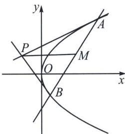

<!-- question-source:start -->
例12 (2025·山西·三模)已知过点 $M(2, 1)$ 的直线交抛物线 $C: y^{2} = 4x$ 于 $A, B$ 两点，过点 $A, B$ 分别作抛物线 $C$ 的切线，两条切线交于点 $P$ ，则 $|PM|$ 的最小值为（）
A. $\frac{7\sqrt{5}}{5}$ B. $\sqrt{5}$ C. $\sqrt{2}$ D. $\frac{15\sqrt{17}}{17}$

<!-- question-source:end -->

![[高中/总复习/专题/2026版高中《mst老唐说题》圆锥曲线专题（数学）/上册/第04章_小题新题型与多选的综合题方法篇/第一节_切线与切点弦/三_抛物线切线方程与阿基米德三角形/例题/answers/Q00048524A1.md]]
