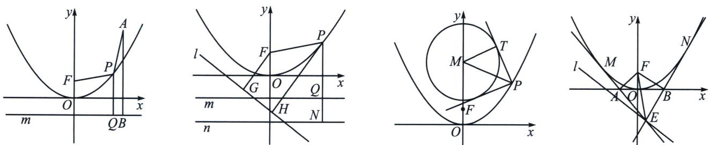

<!-- question-source:start -->
例13 (2025·多选·四川南充二模)已知抛物线 $C: x^{2} = 4y$ 的焦点为 $F$ , 过 $x$ 轴下方一点 $P(x_{0}, y_{0})$ 作抛物线 $C$ 的两条切线, 切点为 $A, B$ , 直线 $PA, PB$ 分别交 $x$ 轴于 $M, N$ 两点, 则下列结论中正确的是

A. 当点 P 的坐标为 $(0, -1)$ 时，则直线 AB 方程为 y=1

B. 若直线 $AB$ 过点 $F$ , 则四边形 $PMFN$ 为矩形

C. 当 $x_{0}^{2} + y_{0}^{2} - 2y_{0} - 8 = 0$ 时， $|AF| \cdot |BF| = 3$

D. $|AB| = 4$ 时, $\triangle PAB$ 面积的最大值为 4
<!-- question-source:end -->

![[高中/总复习/专题/2026版高中《mst老唐说题》圆锥曲线专题（数学）/上册/第04章_小题新题型与多选的综合题方法篇/第一节_切线与切点弦/三_抛物线切线方程与阿基米德三角形/例题/answers/Q00048525A1.md]]
