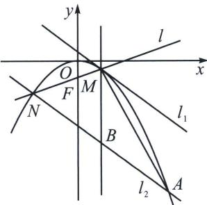

> [!faq]- 《圆锥曲线专题(上册)》例题解析
>
> > [!success]- **【答案】** 36
>
> > [!note]- **【解析】**
> > 解析 由题意知抛物线 C 的焦点为 $F\left(0, -\frac{3}{2}\right)$ ，易知直线 $l: (x_{1} + x_{2})x = -6y + x_{1}x_{2}$ ，由于过 $F\left(0, -\frac{3}{2}\right)$ ，所以 $x_{1}x_{2} = -9$ ， $l_{1}: xx_{1} = -3(y + y_{1})$ ， $l_{2}: (x_{2} + x_{3})x = -6y + x_{2}x_{3}$ ，由于 $l_{1} // l_{2}$ ，故 $-\frac{x_{1}}{3} = -\frac{x_{2} + x_{3}}{6}$ ，即 $x_{A} = x_{3} = 2x_{1} - x_{2} = 2x_{1} + \frac{9}{x_{1}}$ ，设直线 $x = x_{1}$ 与 $l_{2}$ 交于点 B，则 $B\left(x_{1}, -\frac{x_{1}^{2}}{3} - \frac{x_{2}^{2}}{6} - 3\right)$ ，
> >
> > 
> >
> > 则 $|MB| = \left| -\frac{x_1^2}{3} -\frac{x_2^2}{6} -3 - y_1\right| = \frac{x_1^2}{6} +\frac{x_2^2}{6} +3 = \frac{x_1^2}{6} +\frac{27}{2x_1^2} +3 = \frac{1}{6}\left(x_1 + \frac{9}{x_1}\right)^2,$ $S_{\triangle AMN} = \frac{1}{2}\mid x_A - x_2\mid \bullet \mid MB| = \frac{1}{2}\mid 2x_1 - x_2 - x_2\mid \bullet \mid MB| = \mid x_1 - x_2\mid \bullet \mid MB| = \left|x_1 + \frac{9}{x_1}\right|\cdot \frac{1}{6}$ $\left(x_{1} + \frac{9}{x_{1}}\right)^{2} = \frac{1}{6}\left(\mid x_{1}\mid +\frac{9}{\mid x_{1}\mid}\right)^{3}\geqslant \frac{1}{6}\left(2\sqrt{\mid x_{1}\mid\bullet\frac{9}{\mid x_{1}\mid}}\right)^{3} = 36,$
> >
> > 当且仅当 $|x_1| = \frac{9}{|x_1|}$ ，即 $x_1 = \pm 3$ 时，等号成立，所以 $\triangle AMN$ 的面积的最小值为36。故答案为36。
