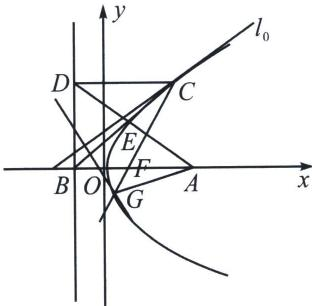

> [!faq]- 《圆锥曲线专题(上册)》例题解析
>
> > [!success]- **【答案】** BCD
>
> > [!note]- **【分析】**
> > 本题未单列分析。
>
> > [!note]- **【解析】**
> > 解析 对于 A，由抛物线 $y^{2}=4x$ ，可得焦点为 $F(1,0)$ ，准线 l 的方程为 x=-1，设 $C(m,n)$ ，由抛物线的焦半径公式可得 $|CF|=m+1=5$ ，解得 m=4，又 $n^{2}=4m=16$ ，解得 $n=\pm4$ ，所以点 C 的坐标为 $(4,4)$ 或 $(4,-4)$ ，故 A 错误；
> > 对于 B，设 $C(t^{2}, 2t)$ ，又 CF 的中点坐标为 $\left(\frac{t^{2}+1}{2}, t\right)$ ，圆的半径为 $\frac{1}{2}|CF| = \sqrt{(t^{2}-1)^{2} + (2t-0)^{2}} = \frac{t^{2}+1}{2}$ ，又 $\left(\frac{t^{2}+1}{2}, t\right)$ 到 y 轴的距离为 $\frac{t^{2}+1}{2}$ ，所以以 CF 为直径的圆与 y 轴相切，故 B 正确；
> > 
> > 对于 C，设 $C(t^{2}, 2t)$ ，则 $D(-1, 2t)$ ，又 $B(-1, 0)$ ， $A(3, 0)$ ，则 $k_{AD} = \frac{2t - 0}{-1 - 3} = -\frac{t}{2}$ ， $k_{CF} = \frac{2t}{t^{2} - 1}$ ，直线 AD 的方程为 $y = -\frac{t}{2}(x - 3)$ ，直线 CF 的方程为 $y = \frac{2t}{t^{2} - 1}(x - 1)$ ，由 $\overrightarrow{EB} + \overrightarrow{EC} = \overrightarrow{AE}$ ，可得 $\overrightarrow{EB} + \overrightarrow{EC} + \overrightarrow{EA} = 0$ ，则 E 是 $\triangle ABC$ 的重心，所以 $E\left(\frac{t^{2} + 3 - 1}{3}, \frac{2t + 0 + 0}{3}\right)$ ，即 $E\left(\frac{t^{2} + 2}{3}, \frac{2t}{3}\right)$ ，又点 E 在 AD 上，则 $\frac{2t}{3} = -\frac{t}{2}\left(\frac{t^{2} + 2}{3} - 3\right)$ ，解得 $t = \pm\sqrt{3}$ ，则点 $E\left(\frac{5}{3}, \pm\frac{2\sqrt{3}}{3}\right)$ ，当 $t = \pm\sqrt{3}$ ，直线 CF 的方程为 $y = \pm\sqrt{3}(x - 1)$ ，因 $x = \frac{5}{3}$ 时，代入上式可得 $y = \pm\sqrt{3}\left(\frac{5}{3} - 1\right) = \pm\frac{2\sqrt{3}}{3}$ ，即点 E 在直线 CF 上，符合，因点 E 到 AB 的距离为 $\frac{2\sqrt{3}}{3}$ ，所以 $\triangle ABE$ 的面积为 $\frac{1}{2} \times 4 \times \frac{2\sqrt{3}}{3} = \frac{4\sqrt{3}}{3}$ ，故 C 正确；
> > 对于 D，设抛物线在点 C 处的切线方程为 $yy_{C}=2(x+x_{C})$ ， $2ty=2(x+t^{2})$ ，故 $k=\frac{1}{t}$ ，则过原点且与切线垂直的直线方程为 y=-tx，由 $\left\{\begin{aligned}y&=\frac{2t}{t^{2}-1}(x-1)\\ y&=-tx\end{aligned}\right.$ 联立，解得 $\left\{\begin{aligned}x&=\frac{2}{t^{2}+1}\\ y&=-\frac{2t}{t^{2}+1}\end{aligned}\right.$ ，即 $G\left(\frac{2}{t^{2}+1},-\frac{2t}{t^{2}+1}\right)$ ，因 C 不是顶点，可设 $t=\tan\theta>0$ ， $0<\theta<\frac{\pi}{2}$ ，（由抛物线对称性知，t<0 也符合）则 $\frac{2}{t^{2}+1}=\frac{2}{\tan^{2}\theta+1}=2\cos^{2}\theta,-\frac{2t}{t^{2}+1}=-2\tan\theta\cos^{2}\theta=-\sin2\theta$ ，于是 $|AG|=\sqrt{(2\cos^{2}\theta-3)^{2}+(-\sin2\theta)^{2}}=\sqrt{(\cos2\theta-2)^{2}+(-\sin2\theta)^{2}}=\sqrt{5-4\cos2\theta}$ ，由 $0<\theta<\frac{\pi}{2}$ ，可得 $0<2\theta<\pi$ ，则 $-1<\cos2\theta<1$ ， $|AG|\in(1,3)$ ，即 D 正确。
> >
> > 故选 **BCD**。
