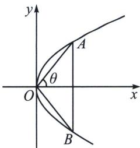
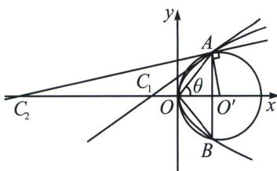

> [!faq]- 《圆锥曲线专题(上册)》例题解析
>
> > [!success]- **【答案】** BC
>
> > [!note]- **【解析】**
> > 解析 由题意得 $\left|x + \frac{3}{4}\right| = \sqrt{\left(x - \frac{3}{4}\right)^2 + y^2}$ ，化简得 $y^{2} = 3x$ 。
> >
> > A 项，当 k=1 时，联立 $\left\{\begin{aligned} y^{2}=3x \\ y=x \end{aligned}\right.$ ，又由题意可知 A 在 x 轴上方，故解得 A(3,3)，由对称性知 B(3,-3)， $|AB|=6$ ，则 $S_{\triangle OAB}=\frac{1}{2}\times3\times6=9$ ，故 A 错误；
> >
> > 
> >
> > 
> >
> > B项，由直线OA的斜率为k，k>0，联立 $\left\{\begin{aligned}y^{2}&=3x\\ y&=kx\end{aligned}\right.$ ，得 $A\left(\frac{3}{k^{2}},\frac{3}{k}\right)$ ，则 $B\left(\frac{3}{k^{2}},-\frac{3}{k}\right)$ ，即 $\overrightarrow{OA}=\left(\frac{3}{k^{2}},\frac{3}{k}\right),\overrightarrow{OB}=\left(\frac{3}{k^{2}},-\frac{3}{k}\right)$ ，设直线OA的倾斜角 $\theta$ ，则 $k=\tan\theta,k>0$ ，
> > 故 $\cos\angle AOB=\frac{\overrightarrow{OA}\cdot\overrightarrow{OB}}{|\overrightarrow{OA}||\overrightarrow{OB}|}=\frac{\frac{9}{k^{4}}-\frac{9}{k^{2}}}{\sqrt{\frac{9}{k^{4}}+\frac{9}{k^{2}}}\cdot\sqrt{\frac{9}{k^{4}}+\frac{9}{k^{2}}}}=\frac{1-k^{2}}{1+k^{2}}$ ，故B正确；
> >
> > C项，由B项可得 $\sin \angle AOB = \sqrt{1 - \left(\frac{1 - k^2}{1 + k^2}\right)^2} = \frac{2k}{k^2 + 1}$ ，且 $|AB| = \frac{6}{k}$ ，则△OAB的外接圆直径 $2R = \frac{3(k^2 + 1)}{k^2} = 3\left(1 + \frac{1}{k^2}\right) > 3$ ，故Γ'的周长大于 $3\pi$ ，C正确；
> >
> > D项，设 $A(3m^2, 3m)$ ，则切线方程为 $yy_A = \frac{3}{2}(x + x_A)$ ，即 $3ym = \frac{3}{2}(x + 3m^2)$ ，令 $y = 0$ ，得 $x = -3m^2$ ，故 $C_1(-3m^2, 0)$ ，由 $2R = 3(1 + m^2)$ ，故 $\triangle OAB$ 的外接圆圆心为 $O'\left(\frac{3}{2}m^2 + \frac{3}{2}, 0\right)$ ，设 $C_2(t, 0)$ ，则 $O'C_2^2 = \left(\frac{3}{2}m^2 + \frac{3}{2} - t\right)^2$ ， $O'A^2 = \left(\frac{3}{2}m^2 - \frac{3}{2}\right)^2 + 9m^2 = \left(\frac{3}{2}m^2 + \frac{3}{2}\right)^2$ ， $AC_2^2 = (3m^2 - t)^2 + 9m^2$ ，由勾股定理可得 $\left(\frac{3}{2}m^2 + \frac{3}{2} - t\right)^2 = \left(\frac{3}{2}m^2 + \frac{3}{2}\right)^2 + (3m^2 - t)^2 + 9m^2$ ，解得 $t = \frac{3m^4 + 3m^2}{m^2 - 1}$ ，故当 $m = \frac{1}{2}$ 时， $C_1\left(-\frac{3}{4}, 0\right), C_2\left(-\frac{5}{4}, 0\right)$ ，此时 $|C_1C_2| = \frac{1}{2} < 24$ ，故 D 错误；
> >
> > 故选 **BC**.
