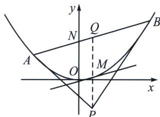

> [!faq]- 《圆锥曲线专题(上册)》例题解析
>
> > [!success]- **【答案】** BCD
>
> > [!note]- **【分析】**
> > 本题未单列分析。
>
> > [!note]- **【解析】**
> > 解析 由抛物线 C: $x^{2}=8y$ ，即 $y=\frac{x^{2}}{8}$ ， $y'=\frac{1}{4}x$ ，当 n=1,3,5,7，…时，过点 $P_{n-2}$ 做抛物线的切线，则切线斜率为： $\frac{1}{4}x_{n-2}$ ，则切线方程为 $y-y_{n-2}=\frac{1}{4}x_{n-2}(x-x_{n-2})$ ，即 $xx_{n-2}=4(y+y_{n-2})$ ，则 $Q_{n-2}\left(\frac{x_{n-2}}{2},0\right)$ ，又 $P_{n-1}$ 为 $P_{n-2}Q_{n-2}$ 中点坐标值为 $x_{n-1}=\frac{3}{4}x_{n-2}$ ， $y_{n-1}=\frac{y_{n-2}}{2}$ ，过 $P_{n-1}$ 的切线 $xx_{n}=4(y+y_{n})$ ，代入 $(x_{n-1},y_{n-1})$ ，得 $x_{n}=\frac{x_{n-2}}{2}$ ， $y_{n}=\frac{y_{n-2}}{4}$ ，可得 $\frac{x_{n}}{x_{n-1}}\neq\frac{x_{n-1}}{x_{n-2}}$ ， $\frac{y_{n}}{y_{n-1}}=\frac{y_{n-1}}{y_{n-2}}=\frac{1}{2}$ ，故 A 错误，B 正确；
> > 又 $x_{n} = \frac{x_{n - 2}}{2}$ ，则 $\frac{x_{2n + 1}}{x_{2n - 1}} = \frac{1}{2}, x_{2n} = \frac{x_{2n - 1} + x_{2n + 1}}{2} >\sqrt{x_{2n - 1}x_{2n + 1}},$
> > 所以 $\frac{x_{2n - 1}}{x_1} = \left(\frac{1}{2}\right)^{n - 1} = \left(\frac{\sqrt{2}}{2}\right)^{2n - 2},\frac{x_{2n}}{x_{2n - 1}} >\sqrt{\frac{x_{2n + 1}}{x_{2n - 1}}} = \frac{\sqrt{2}}{2}$ ，所以 $\frac{x_{2n}}{x_1} >\frac{\sqrt{2}}{2}\frac{x_{2n - 1}}{x_1} = \frac{\sqrt{2}}{2}\cdot \left(\frac{1}{2}\right)^{n - 1} = \left(\frac{\sqrt{2}}{2}\right)^{2n - 1},$ 则 $\sum_{i = 1}^{n}\frac{x_i}{x_1} = 1 + \frac{x_2}{x_1} +\frac{x_3}{x_1} +\dots +\frac{x_n}{x_1} >1 + \frac{\sqrt{2}}{2} +\left(\frac{\sqrt{2}}{2}\right)^2 +\left(\frac{\sqrt{2}}{2}\right)^3 +\dots +\left(\frac{\sqrt{2}}{2}\right)^{n - 1} = \frac{1 - \left(\frac{\sqrt{2}}{2}\right)^n}{1 - \frac{\sqrt{2}}{2}} =$ $(2 + \sqrt{2})\left[1 - \left(\frac{1}{2}\right)^{\frac{n}{2}}\right]$ ，故D正确；
> > 过点 $P_{2n - 1}$ 的切线为 $xx_{2n - 1} = 4(y + y_{2n - 1})$ ，所以 $k_{P_{2n - 1}P_{2n}} = \frac{x_{2n - 1}}{4}$ ，令 $y = 0$ ， $x = \frac{x_{2n - 1}}{2}$ ，即 $Q\left(\frac{x_{n - 2}}{2},0\right)$ 又 $F(0,2)$ ， $k_{Q_{2n - 1}F} = -\frac{4}{x_{2n - 1}}$ ， $k_{P_{2n - 1}P_{2n}}\cdot k_{Q_{2n - 1}F} = -1$ 所以 $\overrightarrow{P_{2n}P_{2n - 1}}\cdot \overrightarrow{Q_nF} = 0$ ，故C正确；故选BCD.
> > ## 2. 抛物线切线与阿基米德三角形性质与结论
> > 阿基米德三角形：圆锥曲线的弦与过弦的端点的两条切线所围成的三角形叫做阿基米德三角形.
> > 抛物线的切线方程完全符合二次曲线的切线方程形式，下面我们来分析一下抛物线的切点弦.
> > 
> > 如图，过点 $P(x_0, y_0)$ 作抛物线 $x^2 = 2py$ 的两条切线 $PA$ 和 $PB$ ，则切点弦 $AB$ 的方程为： $xx_0 = p(y + y_0)$ .
> > 若 AB 中点为 Q，AB 交 y 轴于点 N(0m)，PQ 交抛物线于点 M，令 $A(x_{1}y_{1})$ ， $B(x_{2}y_{2})$ ，则有以下推论：
