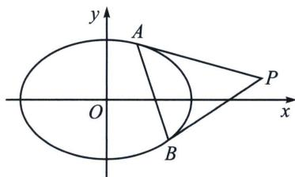

## 二、切线方程和切点弦方程求法的书写过程

我们尝试来求椭圆 $\frac{x^2}{a^2} +\frac{y^2}{b^2} = 1$ 上一点 $P(x_0,y_0)$ 处的切线方程，

解法一(参数换元+判别式): 令 $\left\{ \begin{array}{l} x_{0} = a \cos \theta \\ y_{0} = b \sin \theta \end{array} \right.$ , 过点 $P(x_{0}, y_{0})$ 的切线方程为 $y - b \sin \theta = k (x - a \cos \theta)$ , 代入椭圆方程联立得: $(k^{2} a^{2} + b^{2}) x^{2} + 2a^{2} k (b \sin \theta - a k \cos \theta) x + a^{2} [(b \sin \theta - a k \cos \theta)^{2} - b^{2}] = 0$

$\Delta=4a^{2}b^{2}\left[k^{2}a^{2}+b^{2}-(b\sin\theta-ak\cos\theta)^{2}\right]=0$ ，所以 $(kas\sin\theta+b\cos\theta)^{2}=0$ ，所以 $k=-\frac{b\cos\theta}{a\sin\theta}$

所以 $y - b\sin \theta = -\frac{b\cos\theta}{a\sin\theta} (x - a\cos \theta)$ ，所以 $y\cdot a\sin \theta +x\cdot b\cos \theta = ab$ ，即 $\frac{xx_0}{a^2} +\frac{yy_0}{b^2} = 1.$

注意：如果是证明切线方程为 $\frac{xx_0}{a^2} +\frac{yy_0}{b^2} = 1$ ，那么可以将 $\left\{ \begin{array}{l}\frac{x^2}{a^2} +\frac{y^2}{b^2} = 1\\ \frac{xx_0}{a^2} +\frac{yy_0}{b^2} = 1 \end{array} \right.$ ，联立方程消除 $y$ ，计算判别式为0.

解法二(分类求导)当点 $P(x_{0}, y_{0})$ 位于第一或第二象限时， $y = b\sqrt{1 - \frac{x^{2}}{a^{2}}}$ ，求导得 $k = y' = \frac{b}{2} \cdot \frac{-\frac{2x}{a^{2}}}{\sqrt{1 - \frac{x^{2}}{a^{2}}}} = -\frac{bx}{a^{2}} \cdot \frac{1}{\sqrt{1 - \frac{x^{2}}{a^{2}}}}$ ，当 $x = x_{0}$ 时， $\sqrt{1 - \frac{x_{0}^{2}}{a^{2}}} = \frac{y_{0}}{b}$ ，故 $k = -\frac{b^{2}x_{0}}{a^{2}y_{0}}$ ，代入切线方程 $y - y_{0} = k(x - x_{0})$ 得： $\frac{xx_{0}}{a^{2}} +$

$\frac{yy_{0}}{b^{2}}=1;$

当点 $P(x_0, y_0)$ 位于第三或第四象限时， $y = -b\sqrt{1 - \frac{x^2}{a^2}}$ ，求导得 $k = y' = -\frac{b}{2} \cdot \frac{-\frac{2x}{a^2}}{\sqrt{1 - \frac{x^2}{a^2}}} = \frac{bx}{a^2} \cdot \frac{1}{\sqrt{1 - \frac{x^2}{a^2}}}$ ，当 $x = x_0$ 时， $\sqrt{1 - \frac{x_0^2}{a^2}} = -\frac{y_0}{b}$ ，故 $k = -\frac{b^2x_0}{a^2y_0}$ ，代入切线方程 $y - y_0 = k(x - x_0)$ 得： $\frac{xx_0}{a^2} + \frac{yy_0}{b^2} = 1.$

注意: 如果按照隐函数求导, 那么可以一次性解决切线方程问题, 但是现行高考开放政策下, 这个切线方程已经属于被默认的正确, 很多时候我们仅需要一个判别式假装证明过程, 即可使用此方程.

我们再来看看切点弦方程，过点 $P(x_0, y_0)$ 作椭圆的两条切线 $PA$ 和 $PB$ ，则切点弦 $AB$ 的方程为： $\frac{xx_0}{a^2} + \frac{yy_0}{b^2} = 1$ .

【证明】解法一(点差法)令 $A(x_{1}, y_{1})$ ， $B(x_{2}, y_{2})$ ，根据其切线方程可知 $\left\{\begin{aligned}l_{PA}&:\frac{xx_{1}}{a^{2}}+\frac{yy_{1}}{b^{2}}=1\\ l_{PB}&:\frac{xx_{2}}{a^{2}}+\frac{yy_{2}}{b^{2}}=1\end{aligned}\right.$ 由于点 $P(x_{0}, y_{0})$ 均在两直线上，故满足 $\left\{\begin{aligned}\frac{x_{0}x_{1}}{a^{2}}+\frac{y_{0}y_{1}}{b^{2}}=1①\\ \frac{x_{0}x_{2}}{a^{2}}+\frac{y_{0}y_{2}}{b^{2}}=1②\end{aligned}\right.$ ，①—②得： $\frac{x_{0}(x_{1}-x_{2})}{a^{2}}+\frac{y_{0}(y_{1}-y_{2})}{b^{2}}=0$ ，即 $k_{AB}=$ $-\frac{b^{2}x_{0}}{a^{2}y_{0}}$ ，再代入 AB 的方程 $y-y_{1}=k_{AB}(x-x_{1})$ 得： $a^{2}yy_{0}+b^{2}xx_{0}=a^{2}y_{1}y_{0}+b^{2}x_{1}x_{0}$ ，同除以 $a^{2}b^{2}$ 得： $\frac{xx_{0}}{a^{2}}+\frac{yy_{0}}{b^{2}}=\frac{x_{1}x_{0}}{a^{2}}+\frac{y_{1}y_{0}}{b^{2}}=1$ ，故切点弦 AB 的方程为： $\frac{xx_{0}}{a^{2}}+\frac{yy_{0}}{b^{2}}=1$ 。

解法二(同构方程)点 $A(x_{1}, y_{1})$ 满足方程 $\frac{x_{0}x_{1}}{a^{2}} + \frac{y_{0}y_{1}}{b^{2}} = 1$ ，点 $B(x_{2}, y_{2})$ 也满足方程 $\frac{x_{0}x_{2}}{a^{2}} + \frac{y_{0}y_{2}}{b^{2}} = 1$ ，故 A、B 均在同构方程 $\frac{x_{0}x}{a^{2}} + \frac{y_{0}y}{b^{2}} = 1$ 上，根据两点确定一直线方程原理，则 AB 方程为： $\frac{xx_{0}}{a^{2}} + \frac{yy_{0}}{b^{2}} = 1$ .

显然，选择同构方程的证法更能体现圆锥曲线的本质，两点确定一直线，两根确定一二次方程，就是二次方程的核心思想.

![[高中/总复习/专题/2026版高中《mst老唐说题》圆锥曲线专题（数学）/上册/第04章_小题新题型与多选的综合题方法篇/第一节_切线与切点弦/二_切线方程和切点弦方程求法的书写过程/例题/Q00048516.md]]
![[高中/总复习/专题/2026版高中《mst老唐说题》圆锥曲线专题（数学）/上册/第04章_小题新题型与多选的综合题方法篇/第一节_切线与切点弦/二_切线方程和切点弦方程求法的书写过程/例题/Q00048517.md]]
![[高中/总复习/专题/2026版高中《mst老唐说题》圆锥曲线专题（数学）/上册/第04章_小题新题型与多选的综合题方法篇/第一节_切线与切点弦/二_切线方程和切点弦方程求法的书写过程/例题/Q00048518.md]]
